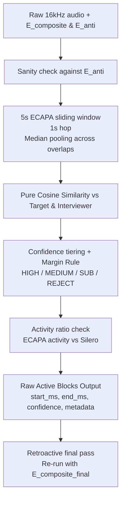

# SPOVNOB — Audio Diarization Pipeline

**Status:** Layer 0 ✅ Finalized | Layer 1 ✅ Finalized | Layer 2 ✅ Finalized | Layer 3 🔲 Pending

**Deployment Scenario:** 5-7 minute video clips · 5-10 videos per batch · Same room · Same microphone · Same interviewer · Same session split into multiple files

**Core Constraints:** Defense-grade. Air-gapped. Minimal human input after initial operator clicks. No data interpolation ever. Time in absolute milliseconds via PTS — never frame-indexed. All outputs must be fully deterministic and reproducible.

---

## Full Pipeline Flow Diagram

```mermaid
flowchart TD
    INPUT["RAW INPUT BATCH<br/>5-10 video files · 5-7 min each<br/>.mp4 / .mov / .mkv<br/>Same room · same mic · same session"]

    INPUT --> FFMPEG

    subgraph L0["LAYER 0 — FOUNDATIONAL EXTRACTION"]
        direction TB
        FFMPEG["FFmpeg Audio Strip<br/>16kHz Mono WAV per file<br/>PTS sync — NOT frame counting<br/>VFR Clock Desync protection"]
        FFMPEG --> PREGATE
        PREGATE["Silero Neural VAD<br/>CPU-resident · ~1MB · Zero VRAM<br/>Non-destructive masking logic"]
        PREGATE --> WAVLM
        WAVLM["WavLM Base+ or Large<br/>10s chunks with 1s overlap-add<br/>Outer 0.5s discarded (boundary artifacts)<br/>Seamless frame embeddings to HDF5"]
    end

    WAVLM --> L1_ENTRY

    subgraph L1["LAYER 1 — VISUAL-ANCHORED ENROLLMENT"]
        direction TB

        L1_ENTRY["Video Frame Stream<br/>Parallel to audio processing<br/>Applied to Video 1 first"]
        L1_ENTRY --> YOLO

        YOLO["YOLOv8<br/>Person detection every frame<br/>Bounding boxes for all persons<br/>Empty frames skipped"]

        YOLO --> OP_CLICK1
        OP_CLICK1["CLICK 1 — Speaking Click<br/>Operator selects target while speaking<br/>System validates: overlap check + min 2s<br/>Re-click prompted if validation fails"]

        OP_CLICK1 --> IFACE
        IFACE["InsightFace<br/>Biometric lock → F_target<br/>Min confidence threshold enforced<br/>Low-confidence frames = not detected"]

        IFACE --> ESEED
        OP_CLICK1 --> ESEED
        ESEED["E_seed — Seed Vector<br/>ECAPA-TDNN d-vector<br/>3-8 sec · 100% verified<br/>SEED ONLY — not production-ready"]

        YOLO --> OP_CLICK2
        OP_CLICK2["CLICK 2 — Anti-Profile Click<br/>Optional · Track C<br/>Operator clicks interviewer if on-camera<br/>Validated: clicked face must differ from F_target"]

        OP_CLICK2 --> EANTI_C["E_anti from Track C<br/>ECAPA-TDNN d-vector<br/>Explicit click · High confidence<br/>Priority over Track B auto-collection"]

        subgraph PHASE3["PHASE 3 — Dual-Track Visual Confirmation Loop<br/>Scans FULL VIDEO (5-7 min)"]
            direction TB
            TRACK_A["TRACK A — Target Enrollment<br/>Face confirmed + lips moving<br/>PTS timestamp → audio window"]
            TRACK_B["TRACK B — Anti-Profile Auto<br/>Face confirmed + lips CLOSED<br/>Audio energy present · single speaker<br/>M-Trap Guard: reject if sim to E_seed is high"]
        end

        ESEED --> PHASE3
        EANTI_C --> PHASE3
        TRACK_B --> EANTI_POOL["E_anti Pool<br/>Track B ECAPA-TDNN d-vectors<br/>Mean-pooled into E_anti"]
        EANTI_POOL --> TRIPLE_GATE

        PHASE3 --> TRIPLE_GATE
        TRIPLE_GATE{"Triple Validation Gate<br/>Every Track A candidate window"}

        TRIPLE_GATE --> |"Gate A FAIL<br/>Overlap detected"|DISCARD_A["Discard · Logged"]
        TRIPLE_GATE --> |"Gate B FAIL<br/>Low sim to E_seed"|DISCARD_B["Discard · Logged"]
        TRIPLE_GATE --> |"Gate C FAIL<br/>High sim to E_anti<br/>OR margin too small"|DISCARD_C["Discard · Logged"]
        TRIPLE_GATE --> |"All gates PASS"|ACCEPTED["Accepted Enrollment Segment<br/>ECAPA-TDNN d-vector extracted<br/>Added to cumulative pool"]

        ACCEPTED --> QUALITY_CHECK
        QUALITY_CHECK{"Enrollment Quality<br/>After each video"}

        QUALITY_CHECK --> |"STRONG<br/>45s+ · low variance"|STRONG_PATH["E_composite PROMOTED<br/>Retroactively reprocess PENDING files"]
        QUALITY_CHECK --> |"MARGINAL<br/>20-45s or high variance"|MARGINAL_PATH["Working draft<br/>Second pass attempted<br/>Carry to next video"]
        QUALITY_CHECK --> |"INSUFFICIENT<br/>Under 20s"|INSUFF_PATH["Layer 2 and 3 DEFERRED<br/>File flagged PENDING<br/>Embeddings retained"]
        QUALITY_CHECK --> |"All videos done<br/>Still insufficient"|CRITICAL_FAIL["CRITICAL ENROLLMENT FAILURE<br/>Terminal halt · Operator required"]

        STRONG_PATH --> COMPOSITE
        MARGINAL_PATH --> COMPOSITE
        INSUFF_PATH --> NEXT_VIDEO["Next Video<br/>Anchors propagate: F_target · E_seed · E_anti · pool"]
        NEXT_VIDEO --> PHASE3

        COMPOSITE["E_composite — Enrollment Profile<br/>Mean-pooled ECAPA-TDNN d-vector<br/>Single cumulative pool · all videos<br/>FROZEN after Layer 1 complete"]

        COMPOSITE --> VARIANCE_GATE
        VARIANCE_GATE{"Quality Variance Gate<br/>Pairwise cosine similarity"}
        VARIANCE_GATE --> |"Low variance"|PASS_L2["E_composite PASSED<br/>Ready for Layer 2"]
        VARIANCE_GATE --> |"High variance"|FLAG_REVIEW["Operator Review<br/>High-variance windows flagged<br/>Human decides · do not auto-discard"]
        FLAG_REVIEW --> PASS_L2
    end

    PASS_L2 --> L2_ENTRY

    subgraph L2["LAYER 2 — PURE ECAPA SLIDING WINDOW SCANNING"]
        direction TB

        L2_ENTRY["Layer 2 Entry<br/>Receives: frozen E_composite, E_anti + raw 16kHz audio<br/>WavLM is bypassed here"]
        L2_ENTRY --> SANITY

        SANITY{"E_composite Sanity Check<br/>sim(E_composite, E_anti)"}
        SANITY --> |"Below warning threshold"|TSVAD_PROC
        SANITY --> |"Above warning threshold"|L2_WARN["Non-blocking warning logged<br/>Enrollment may be contaminated<br/>Operator alerted · proceeds"]
        SANITY --> |"Critically high"|L2_HALT["BLOCKING HALT<br/>Compromised enrollment<br/>Re-run Layer 1 required"]
        L2_WARN --> TSVAD_PROC

        TSVAD_PROC["ECAPA-TDNN Sliding Window Processor<br/>Pure Cosine Similarity Scoring<br/>5s window · 1s hop · Median pooling<br/>Fully deterministic · CUDA det. mode enforced"]
        TSVAD_PROC --> TIER

        TIER{"Confidence Tier Gate<br/>If E_anti exists: P(T) > 0.85 AND (P(T) - P(I)) > margin<br/>If E_anti missing: P(T) > 0.85 (flagged)"}

        TIER --> |"HIGH confidence"|RAW_OUT["Output Raw Active Blocks<br/>1-second fragments<br/>Passed to Layer 3 for smoothing"]
        TIER --> |"MEDIUM 0.65-0.85"|MED_LOG["Sub-threshold Evidence Log<br/>NEVER auto-fed to HuBERT<br/>Human review only<br/>Future Option B: may go to Layer 3<br/>if human review unavailable"]
        TIER --> |"0.30 to 0.65"|SUBLOG["Sub-threshold Evidence Log<br/>Investigative evidence only"]
        TIER --> |"Below 0.30"|REJ["Rejected<br/>Timestamp + score logged"]

        RAW_OUT --> RATIO_CHECK
        RATIO_CHECK{"Activity Ratio Check<br/>ECAPA activity vs Silero total speech"}
        RATIO_CHECK --> |"Above 0.25<br/>Normal"|L2_OUT
        RATIO_CHECK --> |"0.10 to 0.25<br/>Low"|L2_ADVISORY["Advisory flag logged<br/>proceeds"]
        RATIO_CHECK --> |"Below 0.10<br/>Near-zero"|L2_ALERT["Alert: zero activity<br/>Silence or model failure<br/>Manual review required · proceeds"]

        L2_ADVISORY --> L2_OUT
        L2_ALERT --> L2_OUT

        L2_OUT["Active Windows Output<br/>start_ms · end_ms · duration_ms<br/>confidence tier · mean/min confidence<br/>enrollment_ref SHA-256<br/>thresholds used · operator_modified flag<br/>PTS-based — never frame-indexed"]

        L2_OUT --> RETRO_PASS
        RETRO_PASS["Retroactive Final Pass<br/>After all videos in batch complete<br/>Re-run Pure ECAPA on ALL files<br/>Frozen E_composite_final · no feedback<br/>SHA-256 output hash computed<br/>Supersedes any earlier results"]
    end

    RETRO_PASS --> L3_ENTRY

    subgraph L3["LAYER 3 — CONTAMINATION FLAGGING (Overlap Detection)"]
        direction TB
        L3_ENTRY["Receives: RAW HIGH confidence frames<br/>Evaluate frames and gaps for overlap"]
        L3_ENTRY --> OVERLAP_DET
        OVERLAP_DET["Explicit Overlap Detector<br/>E-SHARC inspired framework<br/>Is anyone else speaking simultaneously?"]
        OVERLAP_DET --> OV_GATE{"Simultaneous speech<br/>in window or gap?"}
        OV_GATE --> |"NO — target alone"|CLEAN_RAW["CLEAN Raw Frames"]
        OV_GATE --> |"YES — overlap"|CONTAM["CONTAMINATED Window<br/>Logged as NaN<br/>Timestamp preserved<br/>Do NOT feed to HuBERT"]
        
        CLEAN_RAW --> L3_SMOOTH["Temporal Smoothing<br/>Merge gaps under 400ms<br/>Only across clean gaps"]
        L3_SMOOTH --> CLEAN["CLEAN Target Segments<br/>Safe for HuBERT"]
    end

    CLEAN --> HUBERT
    CONTAM --> AUDIT_LOG

    HUBERT["HuBERT<br/>Paralinguistic Feature Extraction<br/>Vocal stress · Hesitation · Cognitive load<br/>ONLY clean target-isolated audio<br/>Zero contamination · Scientifically valid"]

    AUDIT_LOG["Audit Log<br/>NaN windows · Enrollment quality history<br/>Discarded candidates · Variance flags<br/>Sub-threshold evidence · Operator decisions<br/>Video gap entries · Drift notices<br/>Operator threshold modifications<br/>SHA-256 output hash<br/>Complete forensic chain of custody"]
```



---

## Layer 0 — Finalized Architecture Notes

### Purpose
Convert raw video audio into clean, noise-gated, frame-level acoustic embedding tensors. No identity decisions made here. Pure signal processing. All embeddings retained until the entire batch is processed and all retroactive passes are confirmed complete.

### Input Scenario
- 5-7 minute video clips, 5-10 files per batch
- Same room, same microphone, same interviewer, same session — split at the file system level
- Treated architecturally as one continuous recording with file-boundary seams

### Components

**Global PTS Clock Initialization**
- Every video file starts with its own PTS clock at 0. To maintain a unified session timeline, the system computes a `file_offset_ms` for each file at batch initialization (the cumulative audio duration of preceding files).
- All absolute timestamps across all layers operate on `global_ms = file_offset_ms + local_pts_ms`. Output logs carry both.

**FFmpeg Audio Strip**
- Strips audio from each video container to 16kHz mono WAV
- Timestamp synchronization via PTS (Presentation Timestamps) — never frame counting
- This is the foundational protection against VFR Clock Desync in all downstream layers

**Pre-Gate: Silero Neural VAD (Non-Destructive Masking)**
- CPU-resident. ~1MB model. Zero VRAM consumption.
- Neural classifier for speech vs. non-speech at frame level.
- **Critical Fix:** Audio is NOT hard-zeroed. Hard-zeroing creates artificial amplitude cliffs that corrupt WavLM's attention context. Instead, Silero passes full, unmodified audio to WavLM.
- Silero's output is saved as a list of `(speech_start_ms, speech_end_ms)` segment pairs. These segments are later used to mask the computed WavLM embeddings during downstream ECAPA processing.

**WavLM Base+ or Large — Sequential Chunked Processing (1s Overlap-Add)**
- Processes the full unmodified 16kHz audio in 10-second chunks with a 1-second overlap between chunks.
- VRAM explicitly flushed between chunks — OOM-safe on RTX 6000.
- **Overlap-Add Stitching:** The system discards the outer 0.5s of every chunk. For example, Chunk N (0s-10s) keeps 0.5s-9.5s. Chunk N+1 (9s-19s) keeps 9.5s-18.5s. They concatenate perfectly with zero duplication and zero averaging.
- **Frame Alignment:** WavLM outputs 20ms frames. A WavLM frame is marked "active" if its center timestamp falls within `[silero_start - vad_tol, silero_end + vad_tol]`.
- **HDF5 Storage:** Output is a mathematically seamless array of 1024-dimensional embedding vectors, written to `.h5` files per video. Datasets include: `embeddings`, `global_pts_ms`, and `silero_mask`. HDF5 ensures fast random access for retroactive ECAPA passes without loading 7GB into RAM.
- Retention policy: ALL frame-level embeddings from ALL files retained until the final retroactive pass across all layers is confirmed complete. WavLM is the most expensive computation in the pipeline — compute once, reuse for all retroactive ECAPA runs.
- WavLM chosen over x-vectors/i-vectors: phonological representations stable under vocal stress changes. x-vectors encode pitch statistics that drift under emotional activation.
- WavLM Base+ (95M params) preferred default: ~50% VRAM vs. Large, within 2-3% accuracy on speaker tasks
- Storage estimate: ~0.7-1.0 GB of embeddings per 5-7 min file × 10 files = ~7-10 GB retained during processing

### Key Constraints
- No audio interpolation or synthetic generation
- VFR drift cannot affect this layer — PTS is the only clock
- No internet or external API calls — fully local inference

---

## Layer 1 — Finalized Architecture Notes

### Purpose
Extract a production-grade Target Enrollment Profile (E_composite) as the acoustic fingerprint for Layer 2 ECAPA. EEND eliminated entirely. All identity anchoring is deterministic and visual. E_composite is frozen after Layer 1 completes and never modified in any later layer.

### ECAPA-TDNN (Speaker Encoder) & The Zero-Training Mandate
- **No Training/Fine-tuning:** This pipeline does **not** train or fine-tune models on the target's data. All models (InsightFace, YOLOv8, ECAPA-TDNN) are run frozen, purely in inference mode.
- **Role of ECAPA-TDNN:** While WavLM extracts acoustic features frame-by-frame (what is being spoken), ECAPA-TDNN distills a sequence of WavLM frames into a single 192- or 256-dimensional identity vector (**d-vector**) representing *who* is speaking.
- **Enrollment Arithmetic:** `E_seed`, `E_anti`, and `E_composite` are all ECAPA-TDNN d-vectors. Enrollment is simply the mathematical mean-pooling of these d-vectors from visually verified audio windows. It is highly deterministic arithmetic, not backpropagation or model weight updates.

### `E_seed` capture strategy for offline review

This pipeline is not live. The operator may watch the video first, identify the longest clean speaking stretch for `F_target`, and only then trigger the first Speaking Click. The goal is to build the strongest possible first `E_seed` from a visibly verified, uninterrupted target-speaking segment rather than the first short utterance that happens to appear.

- Preferred capture behavior:
    - Review the full video before clicking.
    - Choose the longest target-speaking segment that is visually clean and not overlapped.
    - Prefer a continuous seed window that is substantially longer than 5 seconds when available.
    - If the target produces a 20–30 second monologue, capture the whole monologue as the seed window.
    - If speech continues longer than 30 seconds and remains clean, the pipeline may keep the window open until the stop rule is satisfied.

- Seed quality intent:
    - The first `E_seed` should be stronger than a minimal seed because it directly improves the stability of all later enrollment gates.
    - A longer clean seed improves ECAPA-d-vector robustness against momentary prosody changes, noise, and small facial-motion artifacts.
    - This is especially important because `E_seed` becomes the reference for Gate B and influences the M-Trap behavior for `E_anti`.

- Updated working length guidance:
    - Minimum acceptable seed length: 3 s.
    - Practical preferred seed length: 5 s or more.
    - Strong seed target range: 20–30 s when a clean continuous speaking stretch exists.
    - No hard maximum unless the operator or validation rules terminate the window.

### `E_window` — definition, capture, and parameters

`E_window` is the atomic enrollment candidate: a contiguous, PTS-aligned audio segment extracted when `F_target` is visually observed speaking. `E_window` is *not* a random chunk; it is a deterministic, visually-anchored segment that may be any length (no hard upper cap) and is subject to minimum-duration requirements.

- Start / Stop policy (visual + audio):
    - **Start trigger (`T_start`)**: when `F_target` is present and the smoothed Mouth Aspect Ratio (MAR) crosses the `MAR_on` threshold *and* Silero VAD indicates speech within ±50 ms, set `T_start` = PTS (ms).
    - **Stop trigger (`T_stop`)**: when MAR falls below `MAR_off`, start a plosive buffer timer (default 500 ms).
        - If the target's MAR rises above `MAR_on` before the timer elapses, continue.
        - **Early Stop Rule:** If the interviewer's face is visible and their MAR rises above `MAR_on` *during* the target's plosive buffer, immediately set `T_stop` to the current PTS and discard the buffer to prevent capturing the interviewer's interjection.
        - If the timer expires cleanly, set `T_stop` = timer expiry PTS.
    - **No arbitrary truncation:** if the subject speaks continuously for 12 seconds, the system captures the full 12-second `E_window`.

- Post-capture checks:
    - **Minimum duration:** discard `E_window` for enrollment if duration < `min_enroll_len` (default 2.0 s). For operator-verified `E_seed`, enforce 3–8 s as the seed window.
    - **ECAPA Chunking Strategy:** If `E_window` duration exceeds 10 seconds, it must be split into 10s overlapping sub-chunks (2s overlap) before passing to ECAPA-TDNN to prevent VRAM overflow. Compute a d-vector for each sub-chunk, then apply **Duration-Weighted Mean Pooling** (`sum(d_i * duration_i) / sum(duration_i)`) into the final `E_window` d-vector. This prevents a residual 2s block from mathematically overpowering a full 10s block.
    - **Gate A (Visual Contamination Check):** Require Silero VAD to confirm speech, AND if the interviewer is visible, require their lips to be closed (`MAR < MAR_off`) for `> 0.80` fraction of the window. This replaces uncomputable energy-ratio logic.
    - **Boundary flags:** mark frames that fall inside Layer 0 chunk boundaries as `boundary_frames` so downstream confidence weighting can apply (boundary frames receive 0.5 weight in Layer 2).

- MAR Definitions & Suggested parameters (tunable via manifest):
    - **MAR Normalization:** MAR is defined as the vertical inner-lip distance divided by the outer mouth width. **Explicit InsightFace 2d106det Indices:** Upper inner lip (52, 53, 54), Lower inner lip (61, 62, 63), Outer width (distance between 52 and 61). This ensures face-scale invariance.
    - **Head Pose Yaw Filter:** If head yaw > 35 degrees, lips project into a foreshortened geometry, artificially crashing MAR. When yaw > 35°, suspend MAR checking entirely. Do not trigger the plosive buffer. Wait for the head to return.
    - `MAR_on` / `MAR_off`: use hysteresis; suggested starting values `MAR_on=0.55`, `MAR_off=0.40` (normalized MAR). Validate per camera/angle.
    - MAR smoothing: 5-frame EMA (causal). *Critical:* Pre-seed the EMA buffer with frame 0's MAR value to prevent 4-frame warmup artifacts at the start of a video.
    - Face Re-ID: `face_reid_threshold = 0.40` (ArcFace cosine sim). Maintains target lock.
    - Plosive buffer: `plosive_ms = 500` ms (tunable 300–700ms).
    - VAD alignment tolerance: `vad_tol = 50` ms.
    - `min_enroll_len = 2.0` s (seed windows: 3–8 s required).

- `E_window` output (persisted):
    - `source_file`, `track_id`, `T_start`, `T_stop`, `duration_ms`, `wav_path` (raw segment), `wavlm_range` (start_frame,end_frame), `boundary_frames`, `mar_trace`, `silero_trace`, `flags` (passed_gates / failed_reason).

### `threshold_target`, `E_anti` capture, and how `E_anti` is used

`threshold_target` is the similarity threshold used in Gate B (enrollment inclusion relative to the verified seed `E_seed`). It is a configurable parameter recorded in the session manifest.

### Enrollment parameter table

These are the current working defaults for `E_window` capture, `E_anti` capture, and the acceptance gates. Every value is tunable only through the append-only manifest unless marked as architectural.

| Parameter | Default | Scope | Purpose | Notes |
|---|---:|---|---|---|
| `silero_threshold` | 0.50 | Layer 0 | VAD binary speech decision | Affects sensitivity to quiet speech vs noise |
| `face_reid_threshold` | 0.40 | `E_window` tracking | ArcFace cosine sim to keep target lock | Warn if running mean drops below 0.50 |
| `MAR_on` | 0.55 | `E_window` capture | Start speaking window when lips clearly open | Computed via InsightFace inner lip normalization |
| `MAR_off` | 0.40 | `E_window` capture | Begin stop timer when lips close | Head yaw > 35° suspends MAR entirely |
| `plosive_ms` | 500 ms | `E_window` capture | Keep window open through short lip closures | Early-stop if interviewer MAR > MAR_on |
| `vad_tol` | 50 ms | `E_window` capture | Align audio speech evidence with lip-motion evidence | Small tolerance for VAD / PTS mismatch |
| `min_enroll_len` | 2.0 s | `E_window` capture | Minimum duration for enrollment candidate | Below this, discard for enrollment and log only |
| `seed_len_target` | 5–30+ s preferred | `E_seed` capture | Recommended seed clip length | Minimum 3 s acceptable. >10s chunks split for ECAPA |
| `int_lips_closed_frac`| 0.80 | `E_window` / Gate A | Ensure interviewer is visually silent | Replaces uncomputable energy ratio logic |
| `threshold_target` | 0.70 | Gate B | Require similarity to `E_seed` | Higher = stricter inclusion |
| `threshold_anti` | 0.50 | Gate C | Require low similarity to `E_anti` | Lower = stricter anti-profile rejection |
| `margin_minimum` | 0.15 | Gate C | Enforce separation between target and anti-profile similarity | Reject ambiguous windows |
| `mtrap_sim_max` | 0.60 | `E_anti` Track B | Discard anti candidates too similar to `E_seed` | Silently discard and log |
| `anti_contam_warning` | 0.45 | `E_anti` sanity check | Warn if `E_composite` may be contaminated | Lowered from 0.60 for extreme sensitivity |
| `anti_contam_halt` | 0.60 | `E_anti` sanity check | Halt if contamination is critically high | Blocking; re-run Layer 1 |
| `pool_var_warning` | 0.05 | `E_composite` pool | Warn if intra-pool variance increases across videos | Detects degrading enrollment quality |

- If `E_anti` is missing, keep the pipeline running and skip Gate C rather than failing closed.
- If the interviewer is off-camera or silent, Track C may be absent and Track B may produce no anti vectors; this is allowed and must not break the batch.

- Recommended defaults (tunable and manifest-logged):
    - `threshold_target` (Gate B): default **0.70** — requires reasonably high similarity to `E_seed` for inclusion.
    - `threshold_anti` (Gate C): default **0.50** — window must have *lower* similarity to `E_anti` than this value to pass.
    - `margin_minimum`: default **0.15** — require `sim(window,E_seed) - sim(window,E_anti) >= margin_minimum` to avoid ambiguous windows.

- `E_anti` capture methods (dual-track):
    - **Track C — Operator Anti-Profile Click (manual):** Operator clicks an on-camera interviewer frame where lips are confirmed closed. That exact PTS window is extracted and converted to an ECAPA d-vector. This `E_anti_C` takes priority over auto-collected anti vectors.
    - **Track B — Automatic Anti-Profile Collection (auto):** Continuously monitor detected faces. When a face (not matching `F_target`) is present with MAR below `MAR_off` (lips closed) and Silero VAD indicates audio-energy at the same PTS, extract a `2000ms` window around that PTS and compute an ECAPA d-vector candidate. Candidates are accepted only if they pass the M-Trap guard (see below). Accepted candidates are appended to the `E_anti_pool`.

- `E_anti` pool and aggregation:
    - Keep an append-only `E_anti_pool` of ECAPA d-vectors from Track B and the prioritized Track C vectors.
    - Compute `E_anti` as the mean-pooled vector of the pool for use in Gate C and sanity checks. Also persist `E_anti_pool_sha256` in the manifest for audit.
    - **Intra-Pool Variance Check:** After each video's contribution is pooled, if the pairwise cosine variance of all d-vectors in the pool increases by more than `pool_var_warning` (default 0.05), log a warning that later enrollments are degrading the profile quality.

- M-Trap Guard (protects against accidental self-enrollment into `E_anti`):
    - For any candidate anti vector `v`, compute `sim(v, E_seed)`. If `sim > mtrap_sim_max` (suggested 0.60) then discard silently (candidate likely the target making a lips-closed phoneme) and log the discard.

- When `E_anti` is used
    - **Triple Validation Gate (during Phase 3)**: For each `E_window` candidate:
        - Gate A: Silero confirms speech AND interviewer lips closed >80% of window.
        - Gate B: `cosine_sim(window, E_seed) >= threshold_target`.
        - Gate C: `cosine_sim(window, E_anti) <= threshold_anti` AND `(sim(window,E_seed) - sim(window,E_anti)) >= margin_minimum`.
        - Only windows passing all three gates are accepted into the enrollment pool.
    - **Sanity checks:** compute `sim(E_composite, E_anti)` after pooling; if above `anti_contam_warning` (0.45) emit non-blocking warning; if above `anti_contam_halt` (0.60) trigger blocking halt and operator re-run of Layer 1.

- Missing `E_anti` / interviewer not visible / no interviewer audio
    - If no `E_anti` exists (no Track C click and `E_anti_pool` empty): do *not* apply Gate C. Instead, log `E_anti_missing=true` in the candidate record and in the manifest. Continue processing but mark enrollment quality as `NO_ANTI_PROFILE` and escalate the variance gate thresholds (i.e., require stronger Gate B similarity or more cumulative seconds to promote to STRONG) — this avoids pipeline breaks while preserving audit warnings.
    - If interviewer visible but interviewer audio missing (no VAD energy): Track B may still produce `E_anti` only if audio-energy is present; otherwise rely on operator Track C or proceed without `E_anti`.

### Persistence, audit, and manifest rules for `E_anti` and `E_window`

- Every time an `E_window`, `E_seed`, or `E_anti` vector is created or modified (pool appended), append an immutable entry to the session manifest with: timestamp_utc, operation, source_file, track_id, PTS range, ECAPA_sha256, vector_dim, operator_id (if applicable), and stated_reason (if operator-modified). This creates the chain-of-custody for enrollment artifacts.
- Store raw WAV segment and the WavLM embedding index range for reproducibility and later re-run.

### Pseudocode snippets

E_window capture loop (frame-driven):

```
if face==F_target:
        mar_s = EMA(mar)
        if not active and mar_s > MAR_on and Silero.vad_near(pts, vad_tol):
                T_start = pts; active=True
        if active and mar_s < MAR_off:
                start plosive_timer(plosive_ms)
        if plosive_timer running and mar_s > MAR_on:
                cancel plosive_timer
        if plosive_timer expired:
                T_stop = current_pts; finalize E_window; active=False
                if duration < min_enroll_len: discard for enrollment else persist
```

E_anti auto-collection (Track B):

```
if face != F_target and face.present and mar_s < MAR_off and Silero.vad_energy_high(pts):
        candidate = extract_window_around(pts, context=2000ms)
        v = ecapa_encode(candidate)
        if sim(v,E_seed) > mtrap_sim_max: discard silently
        else append_to_E_anti_pool(v)
```


### Recommended ECAPA-TDNN Variant

- **Choice:** ECAPA-TDNN (C=1024) — recommended for SPOVNOB given available compute resources.
- **Rationale:** The C=1024 variant shows consistent absolute EER improvements (~0.12–0.14) over C=512 on standard benchmarks at the cost of ~2.4× parameters (14.7M vs 6.2M). With abundant VRAM and CPU (48GB VRAM, 44 cores) this accuracy gain improves forensic sensitivity where small verification gains can be meaningful.
- **Operational notes:** Expect larger model files, higher VRAM usage and longer per-window inference time. Keep C=512 as a documented fallback for constrained or ad-hoc checks, but use C=1024 as the production default for enrollment and ECAPA-conditioned extraction.
- **Validation:** Run a small benchmark on representative enrollment (3–8s) and evaluation clips to measure EER, inference latency, and VRAM. Record the results and the chosen parameterization in the session manifest.

### Why EEND Was Eliminated
- **Hazard A — Label Permutation:** EEND processes in chunks with randomly swapped speaker labels between chunks. Stitching a coherent multi-file timeline is mathematically unstable and forensically indefensible.
- **Hazard B — VFR Tensor Desync:** AV-fusion EEND-M2F requires perfectly paired audio/video tensors. VFR footage cannot be paired without interpolation. Interpolation violates the no-synthetic-data mandate.

### Video Scan Window
For 5-7 minute videos: the Visual Confirmation Loop scans the **entire video**. VFR drift at 7 minutes is negligible for enrollment purposes. Scanning the full video maximizes verified enrollment audio per file.

### Operator Input — Minimal and Validated

| Click | Who | When | Status |
|---|---|---|---|
| Click 1 — Speaking Click | Target | Any moment target is observed speaking | Mandatory · Video 1 only · operator may pre-review the clip and choose the longest clean speaking stretch |
| Click 2 — Anti-Profile Click | Interviewer | Interviewer visible, target lips confirmed closed | Optional · Track C · If interviewer never on-camera, omit |

After Video 1: all anchors (`F_target`, `E_seed`, `E_anti`, cumulative pool) propagate automatically. No further clicks unless a validation guard fails.

### Anti-Profile Dual-Track Strategy
**Track C (Manual):** Operator Anti-Profile Click when interviewer is on-camera. High confidence. Takes priority. Validated: clicked face must not match F_target.

**Track B (Automatic):** Always running. Conditions: InsightFace confirms target present + LAD confirms lips CLOSED + audio energy present + single-speaker dominant. M-Trap Guard: cross-check every candidate against E_seed — high similarity means target was making a lips-closed phoneme, discard.

Both tracks contribute to the E_anti pool. Track C takes priority. If interviewer is never on-camera, Track B builds E_anti entirely automatically.

### Phase-by-Phase Summary

| Phase | Action | Output |
|---|---|---|
| Phase 1 | Speaking Click + immediate validation | E_seed (3-8 sec, 100% verified seed) |
| Phase 2 | Anti-Profile Click (optional) + Track B auto | E_anti (dual-track anti-profile) |
| Phase 3 | Full-video Dual-Track Visual Confirmation Loop | Pool of triple-validated enrollment windows |
| Phase 4 | Cumulative Pool Construction | E_composite (recalculated after each video) |
| Phase 5 | Quality Variance Gate | Pass / Flag for operator review |

### The Triple Validation Gate
Every Track A candidate window must simultaneously pass:
- **Gate A:** Single-speaker energy dominance — no overlap
- **Gate B:** `cosine_sim(window, E_seed) > threshold_target`
- **Gate C:** `cosine_sim(window, E_anti) < threshold_anti` AND `sim(window, E_seed) - sim(window, E_anti) > margin_minimum`

Windows where the target/interviewer similarity margin is critically small are discarded as ambiguous even if they individually pass Gates B and C.

### Progressive Enrollment Quality States

| State | Trigger | System Action |
|---|---|---|
| STRONG | ≥ 45s verified · low variance | E_composite promoted. Pass to Layer 2. Retroactively reprocess all PENDING files. |
| MARGINAL | 20-45s OR high variance | Second pass of same video with improved anchor. Carry to next video. Log warning. |
| INSUFFICIENT | < 20s | Defer Layer 2+3. Flag file PENDING. Retain WavLM embeddings. Carry partial E_composite. |
| CRITICAL FAILURE | All videos done · still INSUFFICIENT | Terminal halt. Operator must intervene. Analysis not possible. |

### Retroactive Reprocessing Rule
When E_composite promotes to a higher state, all PENDING files have Layer 2 and Layer 3 re-run on their stored WavLM embeddings with the improved E_composite. Re-run is cheap — WavLM (expensive) already done, only ECAPA (lightweight) repeats. No behavioral data permanently lost.

### Cumulative Pool
Single growing pool across all videos. Every triple-validated window from every video added to this pool. E_composite recalculated after each video's contribution (running mean-pool). ECAPA for Video 2 already uses a better E_composite than Video 1. No session-level intermediate vectors.

### The 9 Guardrails

| # | Guard | Trigger | Response |
|---|---|---|---|
| 1 | Speaking Click overlap check | Simultaneous speech at click timestamp | Alert: re-click required |
| 2 | Speaking Click min duration | Seed clip < 2 seconds | Alert: re-click required |
| 3 | Anti-Profile identity check | Clicked face matches F_target | Alert: wrong person clicked |
| 4 | M-Trap guard on Track B | E_anti candidate has high sim to E_seed | Silently discard |
| 5 | InsightFace confidence threshold | Detection confidence below minimum | Frame treated as not detected |
| 6 | Low detection quality warning | Running average confidence below floor | Alert: camera angle may be poor |
| 7 | Separation margin check | sim(E_seed) - sim(E_anti) below minimum | Discard as ambiguous |
| 8 | Acoustic similarity warning | sim(E_seed, E_anti) above critical threshold | Alert: voices acoustically similar |
| 9 | Critical enrollment failure | All videos done, still INSUFFICIENT | Terminal halt |

### Cross-File Behavior
- Anchor propagation: F_target, E_seed, E_anti, cumulative pool carry forward Video 1 → all subsequent videos automatically
- No threshold recalibration needed: same room, same mic, same session — acoustic space is identical across all files
- Video gap logging: audit log records a gap entry at the start of each video after Video 1

---

## Layer 2 — Finalized Architecture Notes

### Purpose
Scan the raw 16kHz audio using the frozen E_composite to produce millisecond-stamped blocks of confirmed target activity. Layer 2 bypasses WavLM entirely. It reads the raw audio and runs a pure ECAPA-TDNN sliding window classifier. All output is fully deterministic and reproducible.

### Layer 2 in one sentence

Layer 2 takes the raw 16kHz audio, scores each sliding window using a pure ECAPA-TDNN dual-target cosine similarity feed against `E_composite` and `E_anti`, aggregates probabilities using median pooling, and emits raw active 1-second blocks for later contamination checking and smoothing in Layer 3.

### Layer 2 flow



### What Layer 2 is actually doing

Layer 2 is not a generic diarizer and it is not a retraining stage. It is a deterministic target-tracking pass. The input is the raw 16kHz audio from Layer 0. The conditioning signal is the frozen `E_composite` from Layer 1. The output is a set of PTS-stamped 1-second blocks where the model believes the target is speaking alone enough to be useful, plus a complete audit trail of the discarded blocks.

The important point is that Layer 2 never creates a new identity model. It only answers: "given the fixed enrollment profile, where in this audio does target speech appear?"

### Core inputs to Layer 2

- `E_composite`: frozen enrollment profile, duration-weighted mean-pooled from triple-validated Layer 1 windows.
- `E_anti`: frozen interviewer anti-profile. 
- Raw Audio: Unmodified 16kHz WAV extraction (Layer 2 bypasses WavLM).
- Silero VAD totals: used for the activity ratio check at the end of each file.

### Core outputs from Layer 2

- Raw `start_ms` and `end_ms` contiguous blocks for each accepted target window (no smoothing applied yet).
- `duration_ms` and `median probabilities`.
- `confidence_tier` for each block.
- `enrollment_ref` and threshold metadata so the result can be traced back to the exact enrollment state.
- Rejected or sub-threshold blocks preserved in the audit log, not thrown away silently.

### Step-by-step execution model

1. Load the frozen `E_composite`, `E_anti`, and the raw 16kHz audio.
2. Run a sanity check against `E_anti` before scoring any file.
3. Slide a fixed 5-second window across the raw audio with a 1-second hop.
4. Extract a 192-dim ECAPA d-vector for each window.
5. Compute cosine similarity against `E_composite` to produce `P(Target)`. If `E_anti` exists, compute similarity against it to produce `P(Interviewer)`.
6. Aggregate the multiple overlapping probabilities for each individual 1-second block using **Median Pooling**.
7. Evaluate the median probability against the confidence tier gate. If `E_anti` exists, the dual-target margin rule is enforced (`P(Target) - P(Interviewer) > margin_minimum`). If missing, only the single target rule is enforced.
8. Compare total HIGH activity against total Silero speech duration.
9. Emit the raw accepted blocks and all metadata directly to Layer 3 (no temporal smoothing applied).
10. After the whole batch finishes, rerun the entire pass with `E_composite_final` and preserve both runs.

### How the sliding window works

The window is fixed at 5 seconds because the classifier needs enough context to distinguish stable target speech from brief false positives, but it still needs to move often enough to catch short utterances and shifts in speaking behavior. The hop is 1 second so the model samples the timeline densely.

The important design choice is that this windowing is done over raw audio, completely bypassing WavLM. While ECAPA is a GPU-bound feature extractor, inference on an RTX 6000 is trivial enough to support fast retroactive scanning without caching intermediate embeddings.

### How a window gets scored (Cosine Similarity)

Each 5-second slice generates an ECAPA d-vector. This vector is evaluated against the frozen `E_composite` (and `E_anti`) via pure cosine similarity. This aligns perfectly with the ArcFace metric space ECAPA is trained on.

Because we use a 5-second window with a 1-second hop, each individual 1-second block is evaluated up to 5 times. To aggregate these overlapping evaluations into a single stable score per block, we use **Median Pooling**. This aggressively strips out sliding-window boundary artifacts and brief hallucinations without artificially depressing the core signal.

### Resolution of Layer 0 Boundary Artifacts

Layer 0 overlap-add boundary stitching applies strictly to the WavLM embeddings passed to HuBERT. Layer 2, which reads raw audio, does not suffer from frame-level boundary artifacts.

### Confidence tiers and what they mean

- `HIGH` (> 0.85): strong enough to be passed forward as active raw speech.
- `MEDIUM` (0.65–0.85): useful evidence, but not auto-fed to HuBERT under the current policy.
- `0.30–0.65`: weak evidence, kept only for investigation and audit.
- `< 0.30`: rejected.

The key rule is that Layer 2 is conservative about what it promotes. It is better to miss a weak window than to feed contaminated or uncertain speech into the later behavioral pipeline.

### Relocation of Temporal Smoothing

Previously, Layer 2 performed temporal smoothing (merging gaps under 400ms). This has been explicitly **removed from Layer 2 and relocated to Layer 3**. 

If Layer 2 prematurely bridges a 300ms gap, it might inadvertently swallow a rapid 300ms interjection by the interviewer, masking it from the overlap detector. Therefore, Layer 2 outputs raw, unmerged contiguous HIGH-confidence blocks. Only after Layer 3 has confirmed that a sequence (and its gaps) is entirely free of overlap will the 400ms temporal smoothing be applied to bridge natural plosives for HuBERT.

### Activity ratio check

At the end of each video, Layer 2 compares the total HIGH-confidence target activity against total Silero speech duration.

- Above 0.25: normal.
- 0.10 to 0.25: low activity advisory.
- Below 0.10: near-zero activity alert.

This is not a hard failure in the usual case. It is a diagnostic signal that can mean silence, poor model alignment, missing audio, or a genuinely quiet speaker.

### Retroactive final pass

The retroactive pass exists because enrollment improves as the batch progresses. Early videos may be scored with a younger `E_composite`; later videos can be rescored with a more stable and more representative profile.

So the pipeline does this twice:

- initial pass during normal processing,
- final pass after the batch is complete with `E_composite_final`.

Both outputs remain in the audit trail, and the final pass supersedes the earlier one for downstream use.

### What Layer 2 does when `E_anti` is missing

The pipeline must not break if there is no interviewer on camera or no interviewer audio.

So when `E_anti` is unavailable:

- Layer 2 still runs,
- the `E_composite` sanity check is skipped or marked as unavailable,
- Gate C is not applied inside the Layer 1 gate logic for later enrollment decisions,
- The Margin Gate degenerates to `P(Target) > 0.85`,
- Outputs are explicitly flagged with `no_anti_profile=true`,
- and the batch continues with an audit note that the anti-profile was missing.

This is a deliberate robustness rule, not an error state.

### Why Layer 2 is separate from Layer 3

Layer 2 answers "where is the target speaking?"

Layer 3 answers "is that target speech contaminated by overlap?"

That separation matters because Layer 2 is allowed to be more permissive about finding candidate speech, while Layer 3 is the final forensic filter before HuBERT.

### The Static Enrollment Mandate
**E_composite is frozen after Layer 1. It never changes in Layer 2.** There is no feedback loop. No self-updating of the enrollment profile during processing. Rationale: a forensic system must be fully reproducible. The same inputs on any date must produce bit-identical outputs. If E_composite updated itself based on its own probabilistic guesses during Layer 2, the system would be non-deterministic — an auditor running the same video two days apart would get different results. This is forensically indefensible. Static enrollment wins.

### Decision 1A — MEDIUM Confidence Tier (Current: Option A)
**Option A (Active):** MEDIUM confidence windows (0.65-0.85) are never automatically fed to HuBERT. They are stored in the sub-threshold evidence log for human review only. The operator may manually authorize specific MEDIUM windows for inclusion after review.

**Option B (Future Upgrade Path):** If fully automated processing without human review becomes a requirement, MEDIUM confidence windows that also pass Layer 3's overlap check (no simultaneous speech) may be elevated to PROVISIONAL CLEAN status and fed to HuBERT with an explicit PROVISIONAL flag in the behavioral profile. Switching from Option A to Option B requires: formal protocol change, updated chain of custody documentation, and re-validation of all affected outputs. This path is documented here so the upgrade does not require architectural redesign.

### Design Decision Summary

| # | Decision | Value | Tunable? |
|---|---|---|---|
| 1 | HIGH confidence threshold | 0.85 default | Yes — operator, manifest-logged with reason |
| 2 | MEDIUM confidence threshold | 0.65 default | Yes — operator, manifest-logged with reason |
| 3 | Sub-threshold evidence log floor | 0.30 | No — architectural constant |
| 4 | Temporal merge threshold | 400ms default, locked | Yes — operator, manifest-logged, strongly discouraged |
| 5 | Sliding window size | 5 seconds | No — architectural constant |
| 6 | Sliding window hop | 1 second | No — architectural constant |
| 7 | Boundary frame weight | 0.5 | No — architectural constant |
| 8 | MEDIUM tier routing | Option A (human review only) | Formal protocol change required to switch |
| 9 | Feedback loop | Killed | Permanent — no upgrade path needed |
| 10 | Determinism mode | CUDA deterministic, float32 | No — forensic requirement |

### Layer 2 Execution Flow

**Step 1 — E_composite Sanity Check**
Before processing any video: compute `sim(E_composite, E_anti)`.
- Below warning threshold → proceed normally
- Above warning threshold → non-blocking warning logged. Operator alerted. Enrollment may be contaminated. Proceed.
- Critically high → BLOCKING HALT. Compromised enrollment. Re-run Layer 1 required.

**Step 2 — Sliding Window ECAPA-TDNN Processing**
Layer 2 bypasses WavLM and reads the original, unmodified 16kHz audio directly from disk.
- Window: 5 seconds (raw audio slice)
- Hop: 1 second
- Action: Generate a 192-dim ECAPA d-vector for the window.
- Score Target: Compute `cosine_sim(window_dvector, E_composite)` -> `P(Target)`.
- Score Interviewer: Compute `cosine_sim(window_dvector, E_anti)` -> `P(Interviewer)`.
- Output: Two probability tracks per 1-second segment.

**Step 3 — Median Pooling Aggregation**
Because of the 1-second hop, frames are evaluated up to 5 times.
- System calculates the median probability across overlapping evaluations for each specific frame.
- Median pooling ensures stability against momentary sliding-window edge artifacts.

**Step 4 — Confidence Tiering & Margin Enforcement**
- **HIGH:** 
  - *If `E_anti` exists:* `P(Target) > 0.85` AND `(P(Target) - P(Interviewer)) > margin_minimum`. 
  - *If `E_anti` is missing:* `P(Target) > 0.85` (must be flagged `no_anti_profile=true` in output block).
  - Raw 1s blocks pass directly to Layer 3.
- **MEDIUM (0.65-0.85):** Sub-threshold evidence log. Human review only (Option A).
- **0.30-0.65:** Sub-threshold evidence log. Investigative only.
- **< 0.30:** Fully rejected. Timestamp and score logged. Nothing further.

**Step 5 — Suspicious Activity Ratio Check**
At end of each video:
- Compute `ratio = total ECAPA HIGH activity / total Silero VAD speech duration`.
- **Context Logging:** Also log `unattributed_speech_ms` (Silero speech minus ECAPA HIGH activity). This allows analysts to determine if a low ratio is due to model failure or simply an interviewer dominating the session.
- ratio > 0.25: normal
- ratio 0.10-0.25: advisory flag logged
- ratio < 0.10: alert logged, manual audio review strongly recommended

**Step 6 — Cross-Video Drift Detection**
At the start of each video after Video 1: compute mean ECAPA confidence for first 30 seconds of detected activity. If this is more than 0.10 below the running mean from the previous video, log a cross-video vocal drift notice. Non-blocking, informational only.

**Step 7 — Retroactive Final Pass**
After all videos in the batch are processed:
- Re-run Steps 2-6 on ALL videos with E_composite_final (frozen, no modifications)
- Supersedes any earlier results from files processed with partial E_composite (PENDING files)
- **Audit Logging Rule:** Both the initial and retroactive results are preserved. The initial-pass results on PENDING files MUST carry an explicit `superseded_by: retroactive_final_pass` flag. The final pass results carry `authoritative: true`.
- The session summary explicitly states which files were reprocessed to prevent analyst confusion.
- Compute SHA-256 hash of the complete output (all active windows, all confidence scores, all metadata)
- Hash recorded in the session manifest

### Determinism and Reproducibility
- True CUDA determinism requires all four settings explicitly configured at runtime. The pipeline will enforce:
  1. `torch.use_deterministic_algorithms(True)`
  2. `torch.backends.cudnn.deterministic = True`
  3. `torch.backends.cudnn.benchmark = False`
  4. `os.environ["CUBLAS_WORKSPACE_CONFIG"] = ":4096:8"`
- System runs a 10-second verification checksum on startup to prove determinism before processing.
- ECAPA model in inference-only mode (no gradients, no dropout)
- Sequential frame processing order (never shuffled)
- Float32 precision throughout (not mixed precision)
- Verification: auditor can reproduce the exact run and verify the SHA-256 output hash matches

### Operator Threshold Manifest Format
Any operator modification to any tunable parameter is recorded in an append-only session manifest:

```
parameter:      "high_confidence_threshold"
default_value:  0.85
operator_value: 0.80
modified_by:    "Operator ID"
timestamp_utc:  "2026-06-07T14:23:00Z"
stated_reason:  "Recording conditions reduce posterior scores"
```

Manifest is append-only. No entry can be modified after writing. It is part of the forensic chain of custody.

### Hazard Resolutions

| Hazard | Resolution |
|---|---|
| Cold start (Video 1 early frames processed with youngest E_composite) | Retroactive final pass gives all of Video 1 a second run with mature E_composite |
| Target genuine silence vs. model failure (indistinguishable) | Suspicious activity ratio flag + alert. Human makes the call. System cannot auto-distinguish. |
| Whisper / very quiet speech | Sub-threshold evidence log captures 0.30-0.65 frames for investigative human review. Never auto-included. |
| Long interviewer monologue masking target voice | Correct NaN gap. Silero VAD unattributed speech duration logged as analyst context. |
| E_composite contamination from Layer 1 | Sanity check gate at Layer 2 entry. Warning or blocking halt by severity. |
| Layer 0 chunk boundary artifacts in embeddings | Resolved at Layer 0 via 1s overlap-add processing. Outer 0.5s discarded; seamless array written to disk. |
| Cascading corruption from feedback loop | Feedback loop killed. No longer a hazard. Static enrollment throughout. |
| Non-deterministic output | CUDA determinism enforced. SHA-256 output hash in manifest for audit. |
| Cross-video vocal drift between recordings | Drift detection at video start. Advisory logged. Analyst informed of context. |
| Operator introducing threshold bias | All modifications in append-only signed manifest with stated reason. Chain of custody preserved. |

### Layer 2 Output Block Format

Layer 2 outputs raw, un-smoothed blocks (1-second fragments) that meet the HIGH tier criteria. Layer 3 is responsible for merging them and applying the `merge_gap_ms` logic.

```
{
  "source_file":          "video_03.mp4",
  "start_ms":             127000,
  "end_ms":               128000,
  "duration_ms":          1000,
  "confidence_tier":      "HIGH",
  "P_Target_median":      0.912,
  "P_Interviewer_median": 0.450,
  "boundary_frames":      0,
  "enrollment_ref":       "E_composite_final_sha256_XXXXX",
  "thresholds_used": {
    "high":               0.85,
    "medium":             0.65,
    "operator_modified":  false
  }
}
```

### Layer 2 → Layer 3 Handoff

| Tier | Overlap? | Final Decision | Reaches HuBERT? |
|---|---|---|---|
| HIGH | No overlap | CLEAN | Yes |
| HIGH | Overlap detected | CONTAMINATED | No → NaN log |
| MEDIUM | Any | Sub-threshold evidence log | No → Human review only |
| 0.30-0.65 | Any | Sub-threshold evidence log | No → Investigative only |
| < 0.30 | N/A | Rejected in Layer 2 | No |

---

## Layer 3 — Forensic Overlap Exclusion (NaN-Only)

**Layer 3 — Contamination Flagging & Temporal Smoothing**
- **Input:** Receives only un-smoothed HIGH confidence 1-second blocks from Layer 2.
- **Overlap Detection:** Feeds the active blocks and intervening gaps into PyAnnote OVD (Overlap Speech Detection).
- **The NaN-Only Exclusion Policy:** If PyAnnote detects simultaneous speech within a block, the entire block is logged as `NaN` (contaminated) and permanently excluded from the HuBERT pipeline. 
  - *Architectural Note:* The system explicitly forbids the use of AI separation models (e.g., HTDemucs, SepFormer) to "salvage" overlapping audio. Separation models hallucinate acoustic structures that are forensically indefensible. Pure exclusion is the only mathematically safe path.
- **Temporal Smoothing:** For blocks that pass the overlap check cleanly, Layer 3 bridges gaps `< 400ms` (natural plosives/breath intakes) to form contiguous speech segments.
- **Output:** Scientifically defensible, target-isolated behavioral data ready for HuBERT paralinguistics.

---

*Document version: Layer 2 finalized — 2026-06-08*
