# Deception Detection — Pipeline Architecture (Revised)

> **Status:** Authored 2026-07-06. Replaces the original prototype block diagram (pre-mono-repo,
> pre-SPOVNOB-merge). Everything drawn **solid** exists and is unit-verified in this repo today;
> everything drawn **dashed / amber** is designed-but-not-built future work.
> **Authority:** component names verified against code at authoring time
> (`main_pipeline.py`, `app/batch_daemon.py`, `analytics/*`, `audio_isolation/core/*`,
> `audio_diarization/SPOVNOB_MASTER_REFERENCE.md`).

## Production data model (the core operating assumption)

A **recording** = one subject, one session, dropped as a bucket of clips:

- **Clip 0 — dedicated baseline video.** The target gives generic information. This clip *is* the
  definition of "normal" for that subject: it drives z-score calibration today, and it is the
  training signal for the future ST-GAE ("fit on baseline = normal; reconstruction error on
  interview = anomaly").
- **Clips 1..N — interview videos.** The material under analysis.
- **No ground truth exists in production, ever.** ELAN-annotated videos exist only as a small
  offline training corpus for future supervised work; nothing in this diagram consumes them.
- **Attribution, not classification.** The end deliverable is *where and how strongly* behavior
  deviates from the subject's own baseline — timestamped, per-feature — not a truth/lie verdict.
  (The old prototype's Temporal Sequence Model → XGBoost/RF classification head is superseded and
  intentionally absent; `analytics/predictive_engine.py` is archived in place — fully commented
  out, kept as a record.)

## Architecture

```mermaid
flowchart TB
    OP["Operator drops recording bucket:<br/>clip 0 = dedicated BASELINE video - target gives generic info<br/>clips 1..N = interview videos"]

    subgraph INTAKE["Intake &amp; Orchestration — app/batch_daemon.py"]
        DAEMON["watchdog intake watcher"] --> LEDGER["BatchLedger — crash-safe batch state"]
        LEDGER --> ORCH["BatchOrchestrator — spawns isolated GPU worker process"]
        ORCH --> PAIR["recording_intake — pair mp4/wav to SPOVNOB file_index by normalized stem"]
    end
    OP --> DAEMON

    subgraph SPOVNOB["SPOVNOB — audio_diarization/ — sealed subprocess, pinned .venv, bit-deterministic, hash-chained audit manifest"]
        L0["Layer 0 — PTS-true audio extraction + Silero VAD speech map"]
        L1["Layer 1 — Visual-anchored enrollment:<br/>operator click → ArcFace face lock → MAR-FSM speech windows<br/>→ ECAPA-TDNN E_seed / E_composite / E_anti → Triple Gate A/B/C → FREEZE<br/>alt: audio-anchored path for bearded / unreliable-MAR subjects"]
        L2["Layer 2 — calibrated sliding-window ECAPA cosine scoring<br/>→ median pooling → HIGH / MEDIUM / SUB / REJECT tiers → edge trim"]
        L3["Layer 3 — PyAnnote overlap detection → void overlapped blocks<br/>→ bridge gaps under 400 ms → slice + SHA-256 hash target-only WAVs"]
        L0 --> L1 --> L2 --> L3
    end
    PAIR --> L0
    L3 --> POUT["pipeline_output.json<br/>clean_segments + file_offset_ms + wav SHA-256s"]
    POUT --> BRIDGE["DiarizationBridge<br/>adapts to TARGET segments - start_ms, end_ms - per clip"]

    subgraph CLIP["Per-clip cascade — process_video_session — runs on baseline AND every interview clip, calibrate=False"]
        CANON["FFmpeg canonicalizer → canonical MP4 + WAV"]
        STREAM["CanonicalStreamReader — RAM-buffered frame stream on master clock"]
        YOLO["YOLOv8 — TensorRT engine if present — double-buffered chunk detection"]
        FL["FaceLock — InsightFace TRT — persistent target person stream"]
        MP["MediaPipe pose pool - 12 workers<br/>geometry + motion + lip-motion logs"]
        OF["OpenFace 3.0<br/>AUs + gaze"]
        ANCHOR["Cross-modal identity anchoring:<br/>lip activity × diarized segments → incongruence flags + diarizer confidence"]
        ISO["Isolated target-only WAV"]
        WAVLM["WavLM acoustic extractor — wavlm-large, layer 14<br/>ONE chunked full-clip pass → cached latent sequence<br/>window block: 20 cols | frame block: 18 frame_ cols on the 30 fps clock"]
        P2["Phase 2 — kinematic engineering + exact 30 fps frame fusion:<br/>hand-face distance, wrist + gaze velocity, AU onset velocity, motion energy<br/>+ frame-level acoustic block — timestamp-bucketed, is_audio_active-masked"]
        P3["Phase 3 — DynamicWindowEngine — 2 s window / 1 s stride:<br/>confidence-weighted fusion + WavLM injection + FFT periodicity + ContextMapper"]
        WCSV["Per-clip windowed CSV — uncalibrated"]
        CANON --> STREAM --> YOLO --> FL
        FL --> MP
        FL --> OF
        MP --> ANCHOR
        ANCHOR --> ISO --> WAVLM
        MP --> P2
        OF --> P2
        WAVLM -->|frame block| P2
        P2 --> P3
        WAVLM -->|window block| P3
        P3 --> WCSV
    end
    PAIR --> CANON
    BRIDGE --> ANCHOR

    subgraph REC["Recording-level orchestration — process_recording_session"]
        FIT["BaselineCalibrator.fit on baseline clip windowed CSV<br/>whole clip, no 30 s cap → per-feature mean / std"]
        STATS["BaselineStats JSON — recording_id_baseline_stats.json"]
        APPLY["BaselineCalibrator.apply — z-score EVERY clip against baseline stats<br/>→ deviation_magnitude per window"]
        ASM["assemble_recording — rebase times by file_offset_ms, concat by file_index,<br/>renumber window_id, deviation_percentile over the whole recording"]
        FIT --> STATS --> APPLY --> ASM
    end
    WCSV -->|baseline clip only| FIT
    WCSV -->|all clips| APPLY
    ASM --> OUT["recording_calibrated.csv<br/>CURRENT DELIVERABLE — per-window deviation report on the global timeline,<br/>read by a human analyst"]

    LEGACY["Legacy single-clip mode — Phase 4 self-calibration<br/>vs own first 30 s — kept for backward compat"]
    WCSV -.-> LEGACY

    subgraph FUT["FUTURE — designed, not built"]
        VMAE["VideoMAE v2 — deep spatiotemporal latents<br/>4th parallel extractor branch"]
        STGAE["ST-GAE — spatio-temporal graph autoencoder over raw synchronized<br/>30 fps frame-level features INCL. the frame-level acoustic block —<br/>fit per subject on baseline clip = normal,<br/>reconstruction error on interview clips = anomaly<br/>acoustic nodes masked by is_audio_active in the loss"]
        REPORT["Temporal Anomaly Attribution Report:<br/>timestamped cognitive-friction segments<br/>+ node-wise reconstruction-error map"]
        VMAE --> STGAE --> REPORT
    end
    STREAM -. future .-> VMAE
    P2 -. future .-> STGAE

    classDef future stroke-dasharray:6 4,fill:#fff8e1,stroke:#b8860b
    classDef deliver fill:#e8f5e9,stroke:#2e7d32
    classDef sealed fill:#ede7f6
    class VMAE,STGAE,REPORT,FUT future
    class OUT,POUT deliver
    class SPOVNOB sealed
    class LEGACY future
```

**Legend:** solid = as-built and unit-verified · dashed/amber = future (designed, not built) ·
green = artifact contract / deliverable · purple = env-isolated sealed subprocess.

## What changed vs. the original prototype diagram

| Prototype (old) | Now |
|---|---|
| No speaker diarization at all — audio went straight to the acoustic model | **SPOVNOB** (entire `audio_diarization/` pipeline) runs first; the acoustic model only ever sees visually-verified, overlap-excluded, target-only speech |
| HuBERT (audio tension signals) | **WavLM** (`microsoft/wavlm-large`, layer 14, dynamic hidden-size reshape) |
| VideoMAE as a live parallel branch | VideoMAE **v2**, explicitly future/deferred (dashed) |
| Baseline calibration = clip against its own opening | **Dedicated baseline clip** (`file_index 0`) → `fit()` once → `apply()` to every clip; global timeline assembly is presentation-only and cannot corrupt stats |
| "Synced Data Storage (Parquet, LMDB, HDF5, Arrow)" | Windowed **CSVs + JSON manifests** (BaselineStats JSON, master manifest, hash-chained SPOVNOB audit log) |
| Temporal Sequence Model (Transformer/LSTM/TCN) → Classification Head (XGBoost/RF) → verdict | **Superseded.** Future end-stage is an **ST-GAE** doing unsupervised, per-subject anomaly *attribution* (reconstruction error vs. the subject's own baseline), not classification |
| Single video in, single output | **Recording** = multi-clip batch (baseline + interviews) on one global clock (`file_offset_ms`), orchestrated by `batch_daemon.py` |
| Confidence/quality scoring as a side concept | Wired in: per-frame `cumulative_confidence`, confidence-weighted window fusion, cross-modal incongruence flags |

## Known validation debt (as-built, but unproven on real footage)

1. `offset_ms` audio↔video alignment — defaults to 0, never empirically measured.
2. `WAVLM_LAYER_INDEX = 14` — proportional-depth placeholder from HuBERT-base layer 7/12, not re-tuned.
3. No real end-to-end `process_recording_session` run through the GPU stack yet (components verified
   against synthetic CSVs only — `tests/verify_*.py`, all green).

## ST-GAE — open design questions (to resolve before building)

- Node/edge definition: which feature channels become graph nodes; spatial vs. temporal edge construction.
- Per-subject fit cost: training an autoencoder per recording on baseline-clip data — architecture must be small/fast enough for that.
- Minimum baseline duration for a stable fit (same failure mode class as `BaselineCalibrationError`, but stricter).
- Relationship to the z-score path: replacement or complement (both consume the baseline clip as "normal"; z-scores are per-feature-independent, ST-GAE models cross-feature structure).
- Whether VideoMAE v2 latents join the graph as nodes or gate it (VideoMAE v2 is itself unscheduled).
