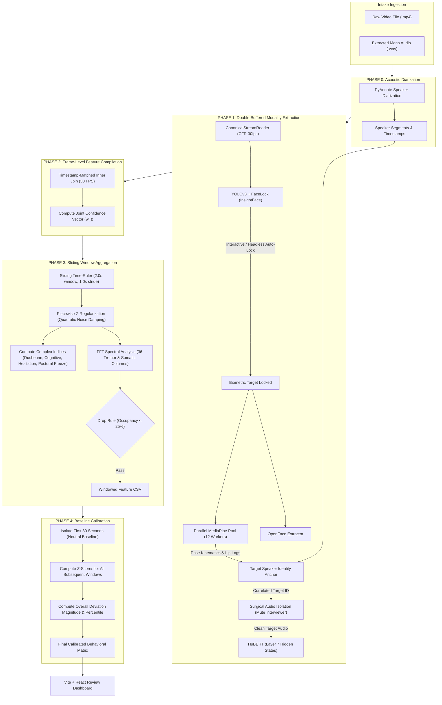

# SPOVNOB: Master Multimodal Analysis & Tracking Pipeline
## Complete Architectural, Technical, and Rationale Reference Guide

This document is the exhaustive master reference guide for the **SPOVNOB Multimodal Production Pipeline**. It details the architectural design, system layout, the exact tooling stack (and *why* those tools were chosen), mathematical models, end-to-end data flows, and infrastructure components implemented in the workspace. 

If you are a new developer, a forensic auditor, or a machine learning engineer tasked with extending this system, this document contains everything you need to know about how the pipeline works, why it was designed this way, and how the data flows from raw bytes to calibrated behavioral matrices.

---

## 1. System Overview & Core Philosophy

The SPOVNOB pipeline is a defense-grade, workstation-optimized multimodal analysis framework. Its core mission is to ingest conversational interview videos, track and isolate a target subject visually and acoustically, extract highly-synchronized pose, face, gaze, and speech features, and compile them into a normalized behavioral deviation timeline.

### Operational Parameters & Constraints
* **Target Environment:** High-performance workstations (e.g., 44-Core CPU, 512GB ECC RAM, single RTX 6000 Ada with 48GB VRAM). The architecture assumes high core counts and abundant memory.
* **Forensic Chain-of-Custody:** Strictly local execution. No cloud APIs, no internet calls. Every run generates a cryptographically audited JSON manifest ledger including SHA-256 file hashes.
* **Timing & Desync Protection:** Absolute millisecond timestamps based on video Presentation Timestamps (PTS) are used across all layers instead of frame indices. This prevents audio/video drift in Variable Frame Rate (VFR) recordings.
* **Zero AI Hallucination (NaN-Only Policy):** If tracking is lost, or if speakers overlap, the system outputs `NaN`. We explicitly *forbid* generative or predictive interpolation. Missing data is a forensic fact; inventing data destroys the integrity of the behavioral analysis.

---

## 2. The Tech Stack: What We Use & Why We Use It

The pipeline is an amalgamation of specialized AI models and signal processing engines. Every tool was chosen deliberately to solve a specific physical or computational constraint.

### A. Video Ingestion & Hardware Orchestration
* **Python 3 `multiprocessing` (Spawn Context)**
  * **Why:** Deep learning frameworks (PyTorch, TensorRT) hold global state in C++ and CUDA contexts. If you process multiple videos sequentially in a single process, GPU memory leaks (CUDA OOM) are inevitable. By using `multiprocessing.get_context('spawn')`, the daemon launches a completely fresh memory space and CUDA context for each video. When the video finishes, the subprocess dies, and the OS reclaims 100% of the VRAM instantly.
* **OpenCV (`cv2`)**
  * **Why:** For frame extraction. Crucially, we use `cv2.CAP_PROP_POS_MSEC` combined with an upstream FFmpeg CFR (Constant Frame Rate) constraint to extract absolute timing. OpenCV is also used for `cv2.solvePnP`, which maps 2D facial landmarks to a 3D physical model to calculate true head pitch, yaw, and roll.

### B. Visual Target Tracking & Locking
* **YOLOv8 (`yolov8n.pt`)**
  * **Why:** We need extremely fast, robust bounding-box detection of humans. The nano (`n`) variant is used because it runs in single-digit milliseconds on an RTX 6000, leaving the heavy compute budget for feature extraction.
* **InsightFace (ArcFace)**
  * **Why:** YOLO only knows "a person" is there; it doesn't know *who* it is. InsightFace extracts highly discriminative 512-dimensional biometric facial embeddings. This provides our `FaceLock` mechanism. If the interviewer leans into the shot, or someone walks behind the target, InsightFace guarantees we never accidentally swap tracking to the wrong person.

### C. Visual Feature Extraction (Kinematics & Micro-Expressions)
* **MediaPipe Holistic (Google)**
  * **What it extracts:** 33 body pose landmarks and 468 face mesh landmarks.
  * **Why:** It is exceptionally lightweight and accurate for body kinematics (wrists, shoulders, nose). 
  * **Crucial Architectural Choice:** We run 12 parallel MediaPipe instances on the CPU using `static_image_mode=True`. Usually, MediaPipe uses a temporal tracker. However, if the tracker loses the face, it produces severe jitter trying to re-acquire. `static_image_mode` forces a clean, independent detection every frame. It costs more CPU, but we have 44 cores, and it guarantees that frame $T$ is mathematically independent of frame $T-1$.
* **OpenFace 3.0**
  * **What it extracts:** Facial Action Units (AUs) and 3D Gaze vectors.
  * **Why:** MediaPipe gives spatial coordinates, but OpenFace provides psychological Action Units (e.g., AU6 Cheek Raiser + AU12 Lip Corner Puller = Duchenne Smile). OpenFace is the gold standard for clinical psychology and micro-expression detection.

### D. Audio Isolation & Acoustic Diarization
* **PyAnnote Audio**
  * **What it extracts:** Acoustic Speaker Diarization (who spoke when).
  * **Why:** It is the current state-of-the-art open-source model for clustering voice identities without needing pre-trained voice profiles.
* **SPOVBNOB MediaPipeAudioDiarizer (Custom Cross-Modal Engine)**
  * **Why:** PyAnnote tells us "Speaker 0" and "Speaker 1", but it doesn't know which one is the visual target. Our custom engine takes the visual lip-movement logs (Mouth Opening Ratio velocity) from MediaPipe and mathematically correlates it with the PyAnnote timestamps. This allows the system to autonomously anchor "Speaker 0" to the visual target without human input.
* **HuBERT (`facebook/hubert-base-ls960`)**
  * **What it extracts:** Paralinguistic features (Layer 7 hidden states).
  * **Why:** Traditional acoustic tools (MFCCs, spectrograms) capture what is said. HuBERT's middle layers (specifically Layer 7) encode *how* it is said—capturing stress, prosodic volatility, and hesitation. We use a MiniBatchKMeans codebook (K=64) over these hidden states to compute Shannon Vocal Entropy.

### E. Backend & Frontend Infrastructure
* **FastAPI**
  * **Why:** Orchestrates the REST API and Server-Sent Events (SSE) for the dashboard. Most importantly, FastAPI natively supports **HTTP 206 Byte-Range requests**. This means the frontend video scrubber can seek instantly through a 5GB video file without downloading the whole thing, just fetching the exact byte chunks needed.
* **React + Vite + Tailwind CSS**
  * **Why:** Provides a modular, high-performance visualization dashboard. We use `recharts` / `chart.js` synchronized to the video playback timeline, allowing analysts to visually inspect exactly what the subject was doing when a feature spiked.

---

## 3. Directory & Workspace Structure

```text
SPOVNOB_NEW/
├── main_pipeline.py                 # Core master orchestrator running Phase 0 to Phase 4
├── SPOVNOB_Master_Pipeline_Summary.md # Focuses on Audio Diarization details (Layers 0-3)
├── Audio_Diarization.md             # Detailed engineering specifications for audio isolation
├── Speaker Diarization.pdf          # Background research and literature on diarization
├── app/                             # Daemon queue supervisor and FastAPI server
│   ├── batch_daemon.py              # Process manager (monitors intake, executes subprocesses)
│   └── server.py                    # REST/SSE control plane and HTTP 206 video streamer
├── ffmpeg_ingestion/                # Audio extraction and video format canonicalization
│   └── core/
│       ├── canonicalizer.py         # Standardizes resolution, sample rate, and enforces 30fps CFR
│       └── batch_canonicalizer.py   # Bulk ingestion script
├── opencv_streaming/                # Constant-rate video frame decompression
│   └── core/
│       └── stream_reader.py         # CanonicalStreamReader ensuring zero A/V drift
├── Yolo_v8/                         # Subject detection and visual target lock
│   └── PersonTracking4/src/
│       ├── detector.py              # YOLOv8 PersonDetector for bounding boxes
│       ├── face_lock.py             # InsightFace/ArcFace biometric tracker
│       └── click_selector.py        # Operator GUI target selector callback
├── mediapipe_pose/                  # Body kinematics extraction
│   ├── parallel_pool.py             # Stateless worker pool (12 workers) + chronological master
│   └── unified_pipeline.py          # Sequential benchmark reference module
├── OpenFace-3.0/                    # Deep learning facial analysis engine
│   └── openface_pipeline/api/
│       └── extractor.py             # OpenFaceExtractor processing Action Units, gaze, emotions
├── audio_isolation/                 # Acoustic diarization and paralinguistic extraction
│   └── core/
│       ├── pyannote_runner.py       # Local PyAnnote speaker diarization execution
│       ├── diarizer_engine.py       # Lip-synced target anchoring & surgical target audio muting
│       └── acoustic_extractor.py    # HuBERT Base Layer 7 feature extractor (vocal entropy codebook)
├── analytics/                       # Temporal windowing and mathematical modeling
│   ├── dynamic_window_engine.py     # Aggregates 30fps records to 2s windows, FFT, and indices
│   ├── confidence_math.py           # Piecewise Z-regularization and spectral FFT engine
│   ├── baseline_calibrator.py       # Z-score normalization against first 30s neutral baseline
│   └── context_mapper.py            # Maps window intervals to question IDs and protocol phases
├── frontend/                        # Interactive web interface for reviewing session features
├── pipeline_system_outputs/         # Session folders containing metadata.json, CSVs, and isolated audio
└── weights/                         # Frozen models, YOLO weights, and TensorRT engines
```

---

## 4. End-to-End Multimodal Data Flow

The orchestrator (`MultimodalProductionOrchestrator` in `main_pipeline.py`) coordinates the data pipeline through five sequential, error-bounded phases. 



---

## 5. Layer-by-Layer Technical Deep Dive

### Phase 0: Acoustic Diarization Pre-Processing
* **Engine:** `PyAnnoteRunner` (configured for CUDA/device execution, running a local model checkpoint to bypass internet requirements).
* **Execution:** Scans the 16kHz mono WAV file before visual frame ingestion. It generates speaker segments `(speaker_id, start_ms, end_ms)`. 

### Phase 1: High-Speed Multimodal Extraction
* **Video Streaming:** `CanonicalStreamReader` decodes frames. It asserts that the video is strict Constant Frame Rate (CFR 30.0fps ±0.1fps) using custom guards. This protects downstream spatial and temporal derivatives from time-base desynchronization.
* **Target Acquisition & Lock:** 
  * In **interactive mode**, cv2 renders a preview window. The user clicks the target speaker. `ClickSelector` registers the click, matches the coordinate to a YOLOv8 bounding box, and triggers `FaceLock` to extract a reference ArcFace facial embedding.
  * In **headless mode**, the pipeline automatically registers `FaceLock` on the first person InsightFace identifies with high confidence.
* **Kinematic Extraction:** Bounding box crops are pushed to `ParallelMediaPipePool` (12 stateless multiprocessing CPU workers). Workers compute coordinate geometry, solvePnP head pose, EAR (eye aspect ratio), and MOR (mouth opening ratio).
* **Facial Expressions:** Bounding box crops are sent to `OpenFaceExtractor` which extracts emotions, gaze directions, and 8 Action Units (AUs): `AU1`, `AU2`, `AU4`, `AU6`, `AU9`, `AU12`, `AU25`, `AU26` using GPU TensorRT acceleration.
* **Acoustic Speaker Correlation & Anchoring:** The `MediaPipeAudioDiarizer` correlates the visual lip-movement log (`is_moving` flag) with the PyAnnote speaker timelines. The diarization ID with the highest mathematical correlation to visual speech is labeled the `Target`.
* **Surgical Audio Isolation:** Once the target ID is identified, the system outputs an isolated WAV file where all non-target speaker segments are muted using hard-zeroing with Hanning window fades to smooth edge transitions and preserve transformer context.
* **Acoustic Feature Extraction:** The isolated target WAV is analyzed by the `HuBERTAcousticExtractor`. Acoustic hidden states are captured from **Layer 7** (empirically shown to contain optimal paralinguistic, stress-correlated information).

### Phase 2: Raw Feature Compilation
* **Chronological Alignment:** Uses a timestamp-based inner join at 30 FPS. Visual frames and diarizer labels are unified.
* **Joint Confidence Vector ($w_t$):** For each frame $t$, the system computes:
  $$w_t = c_{yolo} \cdot c_{facelock} \cdot c_{landmark} \cdot c_{diarizer}$$
  Where confidence scores are normalized between `[0.0, 1.0]`. If any confidence component is missing (NaN), it is default-gated to `0.0`. This joint confidence vector serves as the weighting metric for all downstream temporal windows.

### Phase 3: Sliding Window Aggregation & Feature Engineering
* **Temporal Slicing:** A sliding window of 2.0 seconds with a 1.0-second stride generates overlapping slices.
* **Confidence-Weighted Aggregation:** To prevent tracking jitter (like head turns, momentary yaw outliers, or face-lock losses) from polluting features, the system uses piecewise Z-regularization:
  $$\text{If } w_t < \text{threshold } (0.35), \quad Z_{\text{reg}, t} = w_t \cdot Z_t$$
  $$\text{If } w_t \geq \text{threshold } (0.35), \quad Z_{\text{reg}, t} = Z_t$$
  
  Aggregated statistics use confidence-weighted metrics:
  $$\mu_w = \frac{\sum (w_t \cdot Z_{\text{reg}, t})}{\sum w_t}$$
  $$\sigma^2_w = \frac{\sum w_t \cdot (Z_{\text{reg}, t} - \mu_w)^2}{\sum w_t}$$
  This quadratic damping aggressively suppresses noisy, low-confidence tracking spikes.
* **Behavioral Periodicity (FFT):** The spectral engine analyzes a 4.0-second lookback block (120 frames at 30fps, providing a $\Delta f = 0.25$ Hz resolution) over six key channels: `head_pitch`, `head_yaw`, `ear`, `AU12_velocity`, `AU25_velocity`, and `macro_motion_energy`.
  * Gaps $\leq 15$ frames are linearly interpolated.
  * The signal is detrended and Hann-windowed.
  * FFT generates Power Spectral Density (PSD) arrays.
  * Metrics (`band_power`, `dominant_freq`, `spectral_entropy`) are computed for **Autonomic Tremor** (4–10 Hz) and **Somatic Postural** (0.5–2 Hz) bands, producing 36 columns.
* **Complex Indices:**
  * **Duchenne Index:** $\text{AU6\_mean} \cdot \text{AU12\_mean}$ (genuine smile tracking).
  * **Cognitive Load Index:** $\text{AU4\_mean} \cdot \text{AU1\_mean}$ (brow furrowing).
  * **Speech Hesitation Index:** $\text{AU25\_mean} \cdot \text{AU26\_mean}$ (mouth parting without speaking).
  * **Disgust Leak:** $\text{AU9\_mean} \cdot (1.0 - \text{AU12\_mean})$.
  * **Postural Freeze Index:** $\text{Stillness\_mean} \cdot \sum \text{AU\_variances}$ (rigid posture paired with facial micro-twitches).
* **Occupancy Drop Rule:** If a window's cumulative confidence ($\sum w_t$) falls below the minimum required frames ($15$ frames, i.e., $25\%$ of a 2s window at 30fps), the entire window is nullified to protect downstream classifiers from sparse data.

### Phase 4: Baseline Calibration
* **Baseline Selection:** The first 30 seconds of the session are designated the "neutral baseline period." The subject is assumed to be in an acclimation/rest state.
* **Z-Score Normalization:** The baseline mean ($\mu_{\text{base}}$) and standard deviation ($\sigma_{\text{base}}$) are computed for each numeric feature column. Standard Z-score normalization is applied to all windows:
  $$Z_{\text{window}} = \frac{X - \mu_{\text{base}}}{\sigma_{\text{base}}}$$
  If a feature remains constant during the baseline ($\sigma_{\text{base}} = 0$), it is marked as `NaN` to denote that it cannot be calibrated.
* **L2 Deviation Vector:** A master deviation scalar is computed per window as the Euclidean norm of all calibrated Z-scores:
  $$\text{deviation\_magnitude} = \sqrt{\sum Z^2_{\text{feature}}}$$
  This provides a unified metric tracking how far the subject's behavior drifts from baseline at any point in the interview.
* **Percentile Rank:** A final `deviation_percentile` column ranks each window's deviation score against the entire session distribution.

---

## 6. Workstation Infrastructure & Services

To support processing heavy video sessions safely, the pipeline uses a decoupled service architecture:

### 1. The Queue Supervisor Daemon (`app/batch_daemon.py`)
* Monitors `SPOVNOB_intake/` for JSON profile files detailing subject video batches.
* **Subprocess Isolation:** Executes each session in a separate subprocess spawned using `multiprocessing.get_context('spawn')`.
* **Resource Management:** Limits active GPU operations to a maximum concurrency of 2 using an `asyncio.Semaphore` and programmatically scales system file descriptors.

### 2. FastAPI Control Center (`app/server.py`)
* Provides REST endpoints returning session lists, metadata, and split JSON matrices (preventing duplicate key bloat).
* **Native HTTP 206 Scrubber Streaming:** Serves local MP4 recordings with full HTTP Range Request support. This enables the frontend video player to scrub and jump frame-by-frame with zero latency.
* **Server-Sent Events (SSE):** Streams live processing updates from the queue ledger directly to the frontend.

### 3. Review Dashboard (`frontend/`)
* Built on Vite + React + Tailwind CSS.
* Features synchronized charting grids showing visual features, acoustic states, and L2 deviation scores mapped side-by-side with the native HTTP 206 video player.
* Allows operators to click any feature anomaly on a line graph to scrub the video player to that exact millisecond.

---

## 7. Critical Operator Thresholds

Operators tuning pipeline behavior can edit settings in the intake session manifests. Core thresholds include:

| Parameter | Default Value | Target Component | Description |
| :--- | :--- | :--- | :--- |
| `min_confidence_threshold` | `0.35` | `dynamic_window_engine` | Lower bound for regularizing raw coordinates. Features below this are regularized to 0. |
| `min_fill_rate` | `0.25` | `dynamic_window_engine` | Minimum fraction of valid frames required to keep a window (25% = 15 frames for 2s window). |
| `calibration_duration_ms` | `30000.0` | `baseline_calibrator` | Duration of baseline calibration period (30 seconds). |
| `adaptive_percentile` | `60.0` | `parallel_pool` | Percentile cutoff of MOR velocities to classify lip movements as active speech. |
| `face_reid_threshold` | `0.40` | `face_lock` | ArcFace similarity limit to lock subject tracking. |
