# SPOVNOB — Pipeline Block Diagram

> One-sentence mental model: **Layer 0 says _where_ speech is · Layer 1 learns _who_ the
> target is (by sight) and freezes an acoustic fingerprint · Layer 2 finds _where the target
> speaks_ · Layer 3 removes _anything overlapped_ — and every byte out is an unmodified slice
> of what came in.**

---

## 1 · The model key (5 frozen models, loaded once, held resident all batch)

| Model | What it is | Job in the pipeline | Device |
|---|---|---|---|
| 🟦 **Silero VAD** | tiny TorchScript voice-activity detector | speech / silence **segment map** (a map, never a mask) | CPU |
| 🟩 **YOLOv8m** | object detector | per-frame **person** gate | GPU |
| 🟩 **InsightFace `buffalo_l`** | SCRFD det + ArcFace + 2d106det + pose | face **biometric lock**, 106-pt **landmarks → MAR**, yaw | GPU |
| 🟨 **ECAPA-TDNN** | SpeechBrain speaker encoder (192-dim d-vector) | **voiceprint** extraction + cosine scoring | GPU |
| 🟧 **PyAnnote segmentation-3.0** | neural overlap detector (OVD) | mark frames with **≥2 simultaneous speakers** | GPU |

---

## 2 · The block diagram

```mermaid
flowchart TD

%% ================= PRE-FLIGHT =================
subgraph PF["⚙️ PRE-FLIGHT · prove the runtime is trustworthy, then load every model once"]
  direction TB
  PF1["<b>Session-Manifest init</b><br/>open the append-only, hash-chained audit log<br/><i>↳ SHA-256 chain (stdlib)</i>"]
  PF2["<b>Environment Gate</b><br/>determinism + version + sealed-model-store checks,<br/>~10 s GPU determinism self-test, then load 5 models<br/><i>↳ CUDA deterministic mode · fully offline</i>"]
  PF1 --> PF2
end

%% ================= LAYER 0 =================
subgraph L0["🎚️ LAYER 0 · WHERE is speech?  — PTS-true extraction + speech map (modifies nothing)"]
  direction TB
  L0a["<b>Audio extraction</b><br/>PTS-true 16 kHz mono WAV, 8 parallel workers<br/><i>↳ FFmpeg / FFprobe</i>"]
  L0b["<b>Speech map</b><br/>32 ms windows → probs → threshold·merge·drop·pad<br/>into integer-ms speech segments<br/><i>↳ Silero VAD (TorchScript, CPU)</i>"]
  L0c["<b>RAM preload</b><br/>whole-batch PCM kept resident as raw bytes;<br/>every later layer slices it, never re-reads disk"]
  L0a --> L0b --> L0c
end

%% ================= LAYER 1 =================
subgraph L1["🧬 LAYER 1 · WHO is the target? — visual-anchored enrollment → frozen voiceprint"]
  direction TB
  L1a["<b>Operator clicks</b><br/>click the target while they speak<br/>(1 mandatory + 1 optional 'anti' click)<br/><i>↳ Click UI (Flask)</i>"]
  L1b["<b>Lock identity</b><br/>biometric lock F_target + find interviewer<br/><i>↳ YOLOv8m (person) + InsightFace SCRFD/ArcFace</i>"]
  L1c["<b>Window machine (MAR FSM)</b><br/>capture spans where the locked face is visibly<br/>speaking; contamination firewall at capture<br/><i>↳ InsightFace 2d106det MAR + yaw + Silero VAD</i>"]
  L1d["<b>E_seed</b><br/>encode the seed window → first voiceprint<br/><i>↳ ECAPA-TDNN d-vector + cosine</i>"]
  L1e["<b>Anti-profile E_anti</b><br/>auto-collect interviewer windows (Track B + M-Trap)<br/>+ optional anti-click (Track C)<br/><i>↳ ECAPA-TDNN</i>"]
  L1f["<b>Triple Gate (A→B→C)</b><br/>A: VAD + interviewer-lips-closed · B: cos≥0.70 to seed<br/>C: cos≤0.50 to anti & margin≥0.15"]
  L1g["<b>E_composite</b><br/>duration-weighted pool of accepted windows,<br/>recomputed after every video<br/><i>↳ ECAPA + weighted mean</i>"]
  L1h["<b>Quality + FREEZE</b><br/>STRONG / MARGINAL / INSUFFICIENT →<br/>freeze E_composite & E_anti (never changed again)"]
  L1alt["<i>alt path —</i> <b>Audio-anchored enrollment</b><br/>bearded / unreliable-MAR target: enroll from<br/>target-solo + VAD spans via ECAPA consensus anchor"]
  L1a --> L1b --> L1c --> L1d --> L1e --> L1f --> L1g --> L1h
  L1b -. "beard flag" .-> L1alt
  L1alt -. "feeds pool" .-> L1g
end

%% ================= LAYER 2 =================
subgraph L2["🎯 LAYER 2 · WHERE does the target speak? — calibrated sliding-window tracking"]
  direction TB
  L2a["<b>Per-session calibration</b><br/>thresholds from genuine (leave-one-out) vs<br/>impostor cosines — a cosine is NOT a probability<br/><i>↳ quantile arithmetic</i>"]
  L2b["<b>Sliding-window scoring</b><br/>5 s / 1 s windows; cos to E_composite & E_anti;<br/>skip windows under 20% speech<br/><i>↳ ECAPA-TDNN + cosine</i>"]
  L2c["<b>Median pooling</b><br/>pool overlapping window scores onto 1 s blocks<br/>(≈5 votes/block) — robust to transients"]
  L2d["<b>Tiering</b><br/>HIGH / MEDIUM / SUB / REJECT,<br/>with margin-fail demotion"]
  L2e["<b>Edge-trim</b><br/>refine HIGH-run boundaries at 250 ms steps<br/>(trim-only — can shrink, never grow)"]
  L2f["<b>Authoritative output</b><br/>single hashed pass → layer2_output.json<br/><i>↳ SHA-256</i>"]
  L2a --> L2b --> L2c --> L2d --> L2e --> L2f
end

%% ================= LAYER 3 =================
subgraph L3["🧹 LAYER 3 · Remove anything OVERLAPPED — exclusion + final output"]
  direction TB
  L3a["<b>Overlap detection (OVD)</b><br/>mark ≥2-simultaneous-speaker regions, once per file<br/><i>↳ PyAnnote segmentation-3.0</i>"]
  L3b["<b>NaN-only exclusion</b><br/>any overlap voids the WHOLE 1 s block → NaN<br/>(excluded, never repaired or separated)"]
  L3c["<b>Gap bridging</b><br/>bridge clean gaps under 400 ms<br/>(overlap-free + interviewer-dominance guard)"]
  L3d["<b>Slice + hash</b><br/>slice ORIGINAL PCM → 16 kHz WAV + JSON sidecar,<br/>each SHA-256 hashed"]
  L3a --> L3b --> L3c --> L3d
end

%% ================= RUNNER + OUTPUT =================
RUN["🔗 <b>Runner</b> · chain L0→L3, write the summary, then re-walk &<br/>re-verify the entire audit chain from disk · <i>SHA-256</i>"]
OUT["📤 <b>OUTPUT</b><br/>PTS-stamped WAV segments of ONLY the visually-verified,<br/>overlap-free target speech + hash-chained audit log"]

%% ================= FLOW =================
PF --> L0 --> L1 --> L2 --> L3 --> RUN --> OUT

%% ================= STYLES =================
classDef pf   fill:#ede7f6,stroke:#5e35b1,color:#1a1035,stroke-width:1px;
classDef l0   fill:#e3f2fd,stroke:#1565c0,color:#0d2235,stroke-width:1px;
classDef l1   fill:#e8f5e9,stroke:#2e7d32,color:#10240f,stroke-width:1px;
classDef l1a  fill:#f1f8e9,stroke:#7cb342,color:#1b2a0a,stroke-dasharray:4 3;
classDef l2   fill:#fff8e1,stroke:#f9a825,color:#3a2c02,stroke-width:1px;
classDef l3   fill:#fbe9e7,stroke:#d84315,color:#3a1206,stroke-width:1px;
classDef run  fill:#eceff1,stroke:#455a64,color:#10191d,stroke-width:1px;
classDef out  fill:#212121,stroke:#000,color:#ffffff,stroke-width:2px;

class PF1,PF2 pf;
class L0a,L0b,L0c l0;
class L1a,L1b,L1c,L1d,L1e,L1f,L1g,L1h l1;
class L1alt l1a;
class L2a,L2b,L2c,L2d,L2e,L2f l2;
class L3a,L3b,L3c,L3d l3;
class RUN run;
class OUT out;
```



---

## 3 · One-liners at a glance

**Layers**

| Layer | One-liner |
|---|---|
| ⚙️ **Pre-flight** | Prove the machine is deterministic and the models are sealed — *then* load all five and hold them resident. |
| 🎚️ **Layer 0** | Turn videos into PTS-true 16 kHz audio + a Silero speech map, preloaded to RAM — modifying nothing. |
| 🧬 **Layer 1** | Replace identity *inference* with identity *witness*: the operator clicks the speaking target, and audio enrolls only when the locked face is visibly speaking. |
| 🎯 **Layer 2** | Score the whole batch against the frozen voiceprint with per-session-calibrated cosines to find where the target speaks. |
| 🧹 **Layer 3** | Drop every overlapped block (exclude, never reconstruct), bridge tiny clean gaps, and cut the final hashed WAVs. |
| 🔗 **Runner** | Orchestrate all stages and certify the run by re-verifying the entire hash chain from disk. |

**Steps & their tools**

| Step | Tool / method | One-liner |
|---|---|---|
| Manifest init | SHA-256 hash chain | Append-only chain of custody, written before every destructive op. |
| Environment gate | CUDA determinism + checksum vendoring | Fail-closed proof that this run is bit-reproducible. |
| Audio extraction | **FFmpeg / FFprobe** | Deterministic first-audio-stream 16 kHz mono extraction with true PTS. |
| Speech map | **Silero VAD** | 32 ms windows → integer-ms speech segments (threshold·merge·drop·pad). |
| Identity lock | **YOLOv8m + InsightFace** | Person gate + ArcFace face lock `F_target` and interviewer. |
| Window machine | **InsightFace 2d106det (MAR) + Silero VAD** | Lip-motion FSM capturing only spans where the locked face speaks. |
| Seed / composite / anti | **ECAPA-TDNN + cosine** | Duration-weighted voiceprints `E_seed → E_composite` and anti `E_anti`. |
| Triple Gate | cosine thresholds + VAD | A (VAD+lips) → B (≥0.70 to seed) → C (≤0.50 to anti, margin ≥0.15). |
| Calibration | quantile arithmetic | Per-session HIGH/MED thresholds from genuine-vs-impostor cosines. |
| Scoring | **ECAPA-TDNN + cosine** | 5 s/1 s sliding windows scored vs `E_composite` & `E_anti`. |
| Median pooling + tiering | `statistics.median` | Robust 1 s-block scores → HIGH/MEDIUM/SUB/REJECT. |
| Edge-trim | fine-grain re-scoring | Trim HIGH-run edges at 250 ms (shrink-only) where bleed lives. |
| Overlap detection | **PyAnnote segmentation-3.0 OVD** | Mark every ≥2-speaker region per file. |
| NaN exclusion + bridge | interval arithmetic | Void whole overlapped blocks; bridge clean sub-400 ms gaps. |
| Slice + hash | PCM slicer + SHA-256 | Cut unmodified original audio into hashed WAVs + sidecars. |

---

<details>
<summary>Plain-text fallback (renders anywhere, even without Mermaid)</summary>

```
 ┌─────────────────────────────────────────────────────────────────────────┐
 │ ⚙ PRE-FLIGHT   Manifest init (SHA-256 chain) → Environment Gate          │
 │                (CUDA determinism + sealed model store → load 5 models)    │
 └─────────────────────────────────────────────────────────────────────────┘
                                     │
 ┌─────────────────────────────────────────────────────────────────────────┐
 │ 🎚 LAYER 0 — WHERE is speech?                                             │
 │   FFmpeg/FFprobe extract (16 kHz, PTS-true)                               │
 │      → Silero VAD speech map  → RAM preload                               │
 └─────────────────────────────────────────────────────────────────────────┘
                                     │
 ┌─────────────────────────────────────────────────────────────────────────┐
 │ 🧬 LAYER 1 — WHO is the target?                                          │
 │   Operator click → YOLOv8m + InsightFace lock F_target                    │
 │      → Window machine (MAR + Silero) → E_seed (ECAPA)                     │
 │      → anti-profile E_anti → Triple Gate A/B/C                            │
 │      → E_composite (recomputed per video) → quality → FREEZE              │
 │   (alt: audio-anchored path for bearded / unreliable-MAR targets)         │
 └─────────────────────────────────────────────────────────────────────────┘
                                     │
 ┌─────────────────────────────────────────────────────────────────────────┐
 │ 🎯 LAYER 2 — WHERE does the target speak?                                │
 │   Per-session calibration → ECAPA 5s/1s sliding-window cosine scoring     │
 │      → median pool to 1 s blocks → tier HIGH/MED/SUB/REJECT               │
 │      → edge-trim (trim-only) → hashed authoritative output                │
 └─────────────────────────────────────────────────────────────────────────┘
                                     │
 ┌─────────────────────────────────────────────────────────────────────────┐
 │ 🧹 LAYER 3 — Remove anything OVERLAPPED                                   │
 │   PyAnnote OVD per file → NaN-void whole overlapped blocks                │
 │      → bridge clean gaps <400 ms → slice ORIGINAL PCM → WAV + SHA-256     │
 └─────────────────────────────────────────────────────────────────────────┘
                                     │
 ┌─────────────────────────────────────────────────────────────────────────┐
 │ 🔗 RUNNER  chain L0→L3 → summary → re-verify full hash chain from disk    │
 └─────────────────────────────────────────────────────────────────────────┘
                                     │
 📤 OUTPUT: PTS-stamped WAVs of ONLY the verified, overlap-free target speech
            + hash-chained audit log
```

</details>

> Source of truth: `SPOVNOB_MASTER_REFERENCE.md` (§0.9 end-to-end flow, Parts 2–6 & 9).
> The Python modules remain authoritative for exact thresholds and operators.
