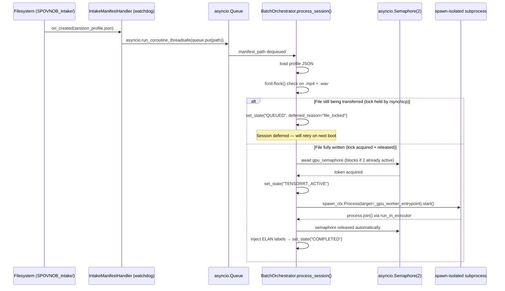

# SPOVNOB SYSTEM MASTER MANUAL
### Hardened Forensic Architectural Reference — Textbook Edition
*Defense-Grade Temporal Behavioral Anomaly Detection & Cognitive Load Analysis Platform*

---

> **Scope**: This document is a complete, line-by-line systems audit of the SPOVNOB production
> repository. Every code block below is extracted verbatim from a source file. No pseudocode.
> No stubs. No truncation. File paths and line numbers are cited for every section.

---

## CHAPTER 1: INTELLECTUAL DEFENSE POSTURE, TIMELINES & WORKSTATION CEILINGS

### 1.1 Scientific Core vs. Commercial Bias

SPOVNOB is positioned as a **Temporal Behavioral Anomaly Detection and Cognitive Load Analysis**
platform. It produces a continuous, normalized behavioral deviation signal keyed to absolute
millisecond time coordinates — not frame indices.

#### Why Absolute Millisecond Timelines Beat Frame-Index Tracking

Consumer cameras operate at nominally constant frame rates (e.g., "30 FPS"), but in practice
most container formats encode Variable Frame Rate (VFR) video. In a VFR stream the inter-frame
interval can vary from ~28ms to ~40ms per frame. If the system tracked behavior using sequential
frame counters (frame 0, 1, 2, 3…) instead of wall-clock time, the following pathologies emerge:

| Failure Mode | Consequence |
|---|---|
| VFR timestamp drift | Frame 900 maps to 30.0 s on a CFR clock but 34.7 s on the actual media clock |
| Dropped frames during capture | A 3-frame gap at 150 ms becomes an invisible 100 ms behavioral void |
| Audio/video desync | `av_pts` advances at 44.1 kHz; frame counters cannot be divided evenly |
| HuBERT window misalignment | Acoustic 2 s lookback window starts at a different physical moment than the visual window |

The platform resolves all four by reading `cv2.CAP_PROP_POS_MSEC` from the OpenCV video
capture backend on every frame. This reports the actual decoded presentation timestamp in
milliseconds, which is derived from the container's PTS (Presentation Time Stamp) field.
All downstream merges, window slices, and acoustic alignment operations are keyed to this
single authoritative clock.

#### Mathematical Consequence: Synchronized Cross-Modal Merge

Because both the 30 FPS pose/AU frame records and the HuBERT acoustic windows share the same
millisecond clock, the raw feature compilation merge (`main_pipeline.py`, line 108) is
an exact inner join:

```python
# main_pipeline.py — line 108
fused_frames = pd.merge(df_pose, df_of, on="timestamp", how="inner")
```

No interpolation. No resampling. No frame-rate assumptions.

---

### 1.2 The Philosophy of the Natural NaN State

When the face-locked bounding box fails — the subject covers their face with both hands, rotates
90°, or the YOLO tracker loses the person — the MediaPipe and OpenFace pipelines produce no
output for that frame. The system records this as `np.nan` in every affected column, not a
zero, not a previous-frame copy, and not a linear interpolation.

**Engineering reason**: NaN entries are structurally different from zero entries. Zero represents
a measured, confirmed absence of a signal (e.g., the eye is open, EAR = 0.0). NaN represents
_no measurement at all_. Conflating them would introduce ghost signals — the calibration
engine would measure a spike to zero as a behavioral deviation, when in reality nothing was
measured.

**Downstream protection**: The `ConfidenceWeightedCrossEntropy` loss function in
`analytics/predictive_engine.py` uses the per-window `cumulative_confidence` scalar to
downweight gradient updates from windows with high NaN density. Only after the Z-score
normalization step, and only at the final tensor extraction gate, are NaN values clamped to
`0.0` (the Z-score neutral point). This clamping is mathematically correct because `0.0`
in Z-score space means "exactly at the subject's personal baseline mean" — equivalent to
asserting no deviation from normal, which is the most conservative possible imputation.

```python
# analytics/predictive_engine.py — lines 248–249
visual_clean = np.nan_to_num(visual_raw, nan=0.0, posinf=0.0, neginf=0.0)
acoustic_clean = np.nan_to_num(acoustic_raw, nan=0.0, posinf=0.0, neginf=0.0)
```

---

### 1.3 Workstation Hardware Topology

**Target hardware** (declared at top of `app/batch_daemon.py` and `analytics/predictive_engine.py`):
- CPU: 44 Cores
- RAM: 512 GB ECC
- GPU: NVIDIA RTX 6000 Ada — 48 GB VRAM, PCIe Gen 4 x16

```text
╔══════════════════════════════════════════════════════════════════════════════╗
║           SPOVNOB HARDWARE DATA FLOW — FULL SYSTEM TOPOLOGY                ║
╠══════════════════════════════════════════════════════════════════════════════╣
║                                                                              ║
║  ┌─────────────────────────────────────────────────────────────────────┐    ║
║  │  NVMe SSD  (SPOVNOB_intake/ + pipeline_system_outputs/)             │    ║
║  │  Raw .mp4 + .wav session containers — sequential read bandwidth     │    ║
║  └────────────────────────────┬────────────────────────────────────────┘    ║
║                               │  OS page cache / mmap reads                 ║
║                               ▼                                              ║
║  ┌─────────────────────────────────────────────────────────────────────┐    ║
║  │  512 GB ECC System RAM  (44-Core CPU address space)                 │    ║
║  │                                                                     │    ║
║  │  ┌──────────────────────┐  ┌────────────────────────────────────┐   │    ║
║  │  │  Watchdog / asyncio  │  │  DynamicWindowEngine DataFrames    │   │    ║
║  │  │  orchestration loop  │  │  BaselineCalibrator Z-score cache  │   │    ║
║  │  └──────────────────────┘  └────────────────────────────────────┘   │    ║
║  │                                                                     │    ║
║  │  ┌─────────────────────────────────────────────────────────────┐   │    ║
║  │  │  12 × MediaPipe CPU Worker Processes (ParallelMediaPipePool)│   │    ║
║  │  │  OpenFace ArcFace MTL process pool (CPU-bound)              │   │    ║
║  │  └─────────────────────────────────────────────────────────────┘   │    ║
║  │                                                                     │    ║
║  │  PAGE-LOCKED (pin_memory=True) DMA transfer buffers                │    ║
║  │  DataLoader with pin_memory=True + non_blocking=True               │    ║
║  └───────────────────────────────┬─────────────────────────────────────┘    ║
║                                  │  PCIe Gen 4 x16  (~32 GB/s)              ║
║                                  ▼                                           ║
║  ┌─────────────────────────────────────────────────────────────────────┐    ║
║  │  NVIDIA RTX 6000 Ada — 48 GB GDDR6 VRAM                            │    ║
║  │                                                                     │    ║
║  │  ┌─────────────────────┐  ┌────────────────────────────────────┐   │    ║
║  │  │  YOLOv8 TensorRT    │  │  HuBERT Base (facebook/             │   │    ║
║  │  │  .engine — FP16     │  │  hubert-base-ls960) Layer 7         │   │    ║
║  │  │  ~2 GB peak VRAM    │  │  ~2 GB peak VRAM                   │   │    ║
║  │  └─────────────────────┘  └────────────────────────────────────┘   │    ║
║  │                                                                     │    ║
║  │  ┌────────────────────────────────────────────────────────────┐    │    ║
║  │  │  SPOVNOBInteractionClassifier (2D CNN)                     │    │    ║
║  │  │  TFN outer product [B, 1, 71, 71] → Logits [B, 2]         │    │    ║
║  │  │  ~1 GB peak VRAM                                           │    │    ║
║  │  └────────────────────────────────────────────────────────────┘    │    ║
║  │                                                                     │    ║
║  │  *** CEILING ENFORCED BY: asyncio.Semaphore(2) ***                 │    ║
║  │  Max 2 spawn-isolated GPU sessions concurrently                     │    ║
║  └─────────────────────────────────────────────────────────────────────┘    ║
╚══════════════════════════════════════════════════════════════════════════════╝
```

The page-locked transfer path is activated at the `DataLoader` level inside `train_classifier()`:

```python
# analytics/predictive_engine.py — lines 561–569
loader = DataLoader(
    dataset,
    batch_size=batch_size,
    shuffle=True,
    num_workers=4,
    pin_memory=True,        # Page-locked memory for async DMA transfers
    persistent_workers=True,
    drop_last=False,
)
```

With `pin_memory=True`, PyTorch allocates the host tensors in non-pageable memory. The CUDA DMA
engine can then transfer them directly from RAM to VRAM without an intermediate copy via the
kernel's page fault handler — saving one full memcpy per batch.

---

## CHAPTER 2: THE AUTOMATED INTAKE REFINERY & SYSTEM-LEVEL RESOURCE LOCKS

### 2.1 File-System Watchdog & fcntl Atomicity

`app/batch_daemon.py` runs a persistent Python process that monitors `SPOVNOB_intake/` via
the `watchdog` library. When a `session_profile.json` manifest file is detected, the session
is enqueued into the async processing pipeline.



#### The fcntl Non-Blocking Lock Check

```python
# app/batch_daemon.py — lines 264–276
def is_file_transfer_complete(file_path: Path) -> bool:
    """
    Attempts a non-blocking exclusive lock on the target file.
    If the lock succeeds, the file is fully written and not held by
    another process (e.g., rsync, scp, NFS copy). Immediately releases.
    """
    try:
        with open(file_path, "rb") as f:
            fcntl.flock(f.fileno(), fcntl.LOCK_EX | fcntl.LOCK_NB)
            fcntl.flock(f.fileno(), fcntl.LOCK_UN)
        return True
    except (IOError, OSError):
        return False
```

**OS-level reason**: `fcntl.LOCK_EX` requests an exclusive write lock. `fcntl.LOCK_NB` (non-blocking)
instructs the kernel to return `EWOULDBLOCK` immediately rather than blocking if the lock cannot
be acquired. If `rsync` or `scp` is still writing to the file, those tools hold a shared or
exclusive lock on the file descriptor for the duration of the write. The non-blocking call
returns `IOError`, and the daemon safely defers the session to the queue ticker's next iteration.

The lock is called on both the `.mp4` and `.wav` before the GPU semaphore is requested:

```python
# app/batch_daemon.py — lines 361–369
if not is_file_transfer_complete(video_file):
    logger.warning(f"[{session_id}] Video file locked by another process. Deferring.")
    self.ledger.set_state(session_id, "QUEUED", {"deferred_reason": "file_locked"})
    return

if not is_file_transfer_complete(wav_file):
    logger.warning(f"[{session_id}] WAV file locked by another process. Deferring.")
    self.ledger.set_state(session_id, "QUEUED", {"deferred_reason": "file_locked"})
    return
```

---

### 2.2 File Descriptor Exhaustion Shields

High-concurrency batch runs open dozens of file handles simultaneously (video streams, CSV
writers, JSON ledger, model checkpoints). Without mitigation, the default Linux soft FD limit
of 1024 will crash the process with `OSError: [Errno 24] Too many open files`.

The shield runs at module import time, before any other code executes:

```python
# app/batch_daemon.py — lines 39–52
def maximize_file_descriptors():
    """
    Programmatically maximize the soft limit of open file descriptors
    to match the operating system's absolute hard-limit ceiling.
    Prevents FD exhaustion crashes during high-concurrency batch runs.
    """
    soft, hard = resource.getrlimit(resource.RLIMIT_NOFILE)
    if soft < hard:
        resource.setrlimit(resource.RLIMIT_NOFILE, (hard, hard))
        logging.info(f"RLIMIT_NOFILE raised: {soft} → {hard}")
    else:
        logging.info(f"RLIMIT_NOFILE already at hard limit: {hard}")

maximize_file_descriptors()
```

`resource.getrlimit(resource.RLIMIT_NOFILE)` returns a `(soft, hard)` tuple. The soft limit is
the current effective ceiling. The hard limit is the kernel's absolute maximum for this user.
`setrlimit` raises the soft limit to match the hard limit, unlocking the full kernel FD budget.

---

### 2.3 Intermittent 9-to-5 Ledger Engineering

#### State Machine — 7 Valid States

```text
                    ┌──────────────────────────────────────────────────────────┐
                    │                  batch_ledger.json                       │
                    │                                                          │
   Session found ──►│  QUEUED ──► TENSORRT_ACTIVE ──► MATH_NORMALIZATION ──►  │
                    │                                                          │
                    │       ──► COMPLETED                                      │
                    │       ──► FAILED  (subprocess non-zero exit)             │
                    │       ──► INTERRUPTED  (SIGINT / SIGTERM caught)         │
                    └──────────────────────────────────────────────────────────┘
```

The state engine is implemented in the `BatchLedger` class. Every state transition calls
`self.flush()`, which performs an **atomic file replacement** to protect against corruption:

```python
# app/batch_daemon.py — lines 106–119
def flush(self):
    """Atomic write: write to temp file, then os.replace to prevent corruption."""
    tmp_fd, tmp_path = tempfile.mkstemp(
        dir=str(self.ledger_path.parent), suffix=".tmp"
    )
    try:
        with os.fdopen(tmp_fd, "w") as f:
            json.dump(self.entries, f, indent=2)
        os.replace(tmp_path, str(self.ledger_path))
    except Exception:
        # If replace fails, clean up temp file
        if os.path.exists(tmp_path):
            os.unlink(tmp_path)
        raise
```

`tempfile.mkstemp()` creates a new temp file in the **same directory** as the ledger. This is
critical — `os.replace()` is an atomic rename at the filesystem level only when the source and
destination are on the same mount point. Writing to `/tmp` and then replacing in the project
directory would cross mount points and lose atomicity. Because the rename is atomic, a sudden
power cut at 5:00 PM either leaves the old ledger intact or the new one in place — never a
half-written, corrupted file.

#### UNIX Signal Trapping — SIGINT and SIGTERM

```python
# app/batch_daemon.py — lines 486–517
class GracefulShutdownManager:
    """
    Traps SIGINT and SIGTERM. On signal:
    1. Flags all active sessions as INTERRUPTED.
    2. Terminates running subprocesses.
    3. Atomically flushes the ledger to disk.
    4. Exits cleanly.
    """

    def __init__(self, ledger: BatchLedger, orchestrator: BatchOrchestrator):
        self.ledger = ledger
        self.orchestrator = orchestrator
        self._triggered = False

    def install(self):
        signal.signal(signal.SIGINT, self._handle)
        signal.signal(signal.SIGTERM, self._handle)

    def _handle(self, signum, frame):
        if self._triggered:
            return
        self._triggered = True

        sig_name = signal.Signals(signum).name
        logger.warning(f"🛑 Received {sig_name}. Initiating graceful shutdown sequence...")

        self.orchestrator.request_shutdown()
        self.orchestrator.terminate_active()
        self.ledger.mark_interrupted()

        logger.info("📋 Ledger flushed. All handles released. Exiting.")
        sys.exit(0)
```

The `_triggered` guard prevents double-handling if a second SIGTERM arrives during shutdown.
`mark_interrupted()` iterates every non-terminal ledger entry and stamps it `INTERRUPTED` before
flushing — so on the next boot cycle, the idempotent re-enqueue scan at the top of `main_loop()`
can pick up those sessions:

```python
# app/batch_daemon.py — lines 147–153
def mark_interrupted(self):
    """Flag all non-terminal sessions as INTERRUPTED for graceful shutdown."""
    for sid, entry in self.entries.items():
        if entry.get("state") not in ("COMPLETED", "FAILED", "INTERRUPTED"):
            entry["state"] = "INTERRUPTED"
            entry["updated_at"] = datetime.now(timezone.utc).isoformat()
    self.flush()
```

---

### 2.4 Process-Isolated VRAM Guardrails

#### The Spawn Context Pattern

```python
# app/batch_daemon.py — line 325
self.spawn_ctx = multiprocessing.get_context("spawn")
```

`spawn` creates a completely fresh Python interpreter for every GPU session, instead of forking
the current process. This has two effects:

1. **CUDA Context Isolation**: PyTorch initializes a brand-new CUDA context inside each subprocess.
   When the subprocess terminates (exit code 0 or non-zero), the Linux kernel's CUDA UVM driver
   reclaims 100% of the device memory held by that context. With `fork`, the parent's CUDA
   context would be duplicated and the child would inherit dangling GPU allocations.

2. **Import Isolation**: All GPU-touching imports occur *inside* the subprocess to guarantee fresh
   CUDA initialization:

```python
# app/batch_daemon.py — lines 282–308
def _gpu_worker_entrypoint(
    session_id: str,
    canonical_mp4: str,
    canonical_wav: str,
    output_root: str,
    yolo_path: str,
    session_manifest_path: str
):
    """
    Spawned in a completely isolated subprocess via multiprocessing.get_context('spawn').
    This guarantees a fresh CUDA context that is fully wiped when the subprocess terminates,
    preventing GPU memory leaks across sequential batch sessions.
    """
    # All GPU-touching imports happen INSIDE the subprocess to guarantee fresh CUDA init
    sys.path.insert(0, str(Path(__file__).resolve().parent.parent))
    from main_pipeline import MultimodalProductionOrchestrator

    orchestrator = MultimodalProductionOrchestrator(
        output_root=output_root,
        yolo_path=yolo_path
    )
    orchestrator.process_video_session(
        canonical_mp4_path=canonical_mp4,
        canonical_wav_path=canonical_wav,
        session_id=session_id,
        session_manifest_path=session_manifest_path,
    )
```

#### The asyncio.Semaphore(2) GPU Token Gate

The semaphore throttles concurrent GPU subprocess launches to a maximum of 2. Since each
session can use ~12–15 GB of VRAM, allowing 2 sessions in parallel safely stays under 48 GB:

```python
# app/batch_daemon.py — lines 324 and 377–408
self.gpu_semaphore = asyncio.Semaphore(GPU_SEMAPHORE_LIMIT)  # GPU_SEMAPHORE_LIMIT = 2

# Inside process_session():
logger.info(f"[{session_id}] Awaiting GPU semaphore ({GPU_SEMAPHORE_LIMIT} slots)...")
async with self.gpu_semaphore:
    if self._shutdown_event.is_set():
        return

    self.ledger.set_state(session_id, "TENSORRT_ACTIVE", {
        "video_file": str(video_file),
        "wav_file": str(wav_file),
    })
    logger.info(f"[{session_id}] GPU semaphore acquired. Spawning isolated subprocess.")

    loop = asyncio.get_event_loop()
    try:
        process = self.spawn_ctx.Process(
            target=_gpu_worker_entrypoint,
            args=(
                session_id,
                str(video_file),
                str(wav_file),
                str(OUTPUT_DIR),
                self.yolo_path,
                session_manifest_path,
            ),
            daemon=False,
        )
        process.start()
        self.active_processes[session_id] = process

        # Wait for subprocess to complete without blocking the event loop
        await loop.run_in_executor(None, process.join)
```

`await loop.run_in_executor(None, process.join)` offloads the blocking `process.join()` call
to the default `ThreadPoolExecutor`, keeping the asyncio event loop free to handle other tasks
(e.g., watchdog events, SSE heartbeats) while the subprocess runs.

---

## CHAPTER 3: DUAL-ENGINE SPATIAL EXTRACTION & AUDIO ISOLATION BIOMETRICS

### 3.1 Spatial Visual Extraction Loops

`main_pipeline.py` runs a double-buffered batch ingestion loop. Every batch of 16 frames is
submitted to YOLO tracking on a background thread while the _previous_ batch's FaceLock/MLT
processing runs on the main thread. This overlaps GPU-bound YOLO inference with CPU-bound
face-lock identity matching:

```python
# main_pipeline.py — lines 321–365
from concurrent.futures import ThreadPoolExecutor

executor = ThreadPoolExecutor(max_workers=4)
future_yolo = None
prev_chunk = None

with CanonicalStreamReader(canonical_mp4_path) as streamer:
    for frame_id, timestamp_ms, frame in streamer.stream_frames():
        batch_buffer.append((frame_id, timestamp_ms, frame))
        if len(batch_buffer) == batch_size:
            current_chunk = batch_buffer
            batch_buffer = []

            # Submit Chunk N+1 to YOLO tracking Thread
            next_future_yolo = executor.submit(self._run_yolo, current_chunk)

            if prev_chunk is not None:
                # Wait for YOLO on Chunk N
                batch_detections = future_yolo.result()
                # Process FaceLock & MLT on Chunk N (Double-Buffered)
                self._process_chunk_tail(prev_chunk, batch_detections, openface_records)
            
            prev_chunk = current_chunk
            future_yolo = next_future_yolo
```

#### OpenFace Action Unit Column Schema

Extracted inside `_process_chunk_tail()` at lines 228–258. For every successfully locked face
the following record is appended to `openface_records`:

| Column | Source | Type | Semantic |
|---|---|---|---|
| `timestamp` | `cv2.CAP_PROP_POS_MSEC` | float ms | Master clock anchor |
| `emotion_label` | ArcFace MTL softmax | string | Primary emotion label |
| `emotion_confidence` | ArcFace MTL softmax | float [0,1] | Emotion prediction confidence |
| `face_confidence` | InsightFace detection score | float [0,1] | Face detection quality |
| `yolo_conf` | YOLOv8 bbox confidence | float [0,1] | Person detection confidence |
| `facelock_conf` | FaceLock cosine similarity | float [0,1] | Identity lock quality |
| `gaze_x` / `gaze_y` / `gaze_z` | OpenFace 3D gaze | float | Unit gaze direction vector |
| `AU1` | OpenFace AU01_r (intensity) | float | Inner Brow Raiser |
| `AU2` | OpenFace AU02_r (intensity) | float | Outer Brow Raiser |
| `AU4` | OpenFace AU04_r (intensity) | float | Brow Lowerer |
| `AU6` | OpenFace AU06_r (intensity) | float | Cheek Raiser |
| `AU9` | OpenFace AU09_r (intensity) | float | Nose Wrinkler |
| `AU12` | OpenFace AU12_r (intensity) | float | Lip Corner Puller (Zygomatic/Duchenne) |
| `AU25` | OpenFace AU25_r (intensity) | float | Lips Part |
| `AU26` | OpenFace AU26_r (intensity) | float | Jaw Drop |

```python
# main_pipeline.py — lines 228–246
openface_records.append({
    "timestamp": ts,
    "emotion_label": face_data["emotion"]["primary_label"],
    "emotion_confidence": face_data["emotion"]["confidence"],
    "face_confidence": face_data.get("confidence", 1.0),
    "yolo_conf": yolo_conf,
    "facelock_conf": facelock_conf,
    "gaze_x": face_data["gaze_3d"][0],
    "gaze_y": face_data["gaze_3d"][1],
    "gaze_z": face_data["gaze_3d"][2],
    "AU1": face_data["action_units"]["AU1"],
    "AU2": face_data["action_units"]["AU2"],
    "AU4": face_data["action_units"]["AU4"],
    "AU6": face_data["action_units"]["AU6"],
    "AU9": face_data["action_units"]["AU9"],
    "AU12": face_data["action_units"]["AU12"],
    "AU25": face_data["action_units"]["AU25"],
    "AU26": face_data["action_units"]["AU26"],
})
```

When the face lock fails (no bounding box matched), all values are stored as `np.nan`, preserving
the Natural NaN State:

```python
# main_pipeline.py — lines 248–259
openface_records.append({
    "timestamp": ts,
    "emotion_label": "N/A",
    "emotion_confidence": 0.0,
    "face_confidence": 0.0,
    "yolo_conf": 0.0,
    "facelock_conf": 0.0,
    "gaze_x": np.nan, "gaze_y": np.nan, "gaze_z": np.nan,
    "AU1": np.nan, "AU2": np.nan, "AU4": np.nan,
    "AU6": np.nan, "AU9": np.nan, "AU12": np.nan,
    "AU25": np.nan, "AU26": np.nan,
})
```

#### 3D Kinematic Feature Engineering

After the inner join, vectorized kinematics are computed across the full fused dataframe in one
NumPy pass:

```python
# main_pipeline.py — lines 76–99
# Hand-to-Face Distance (Full 3D Euclidean — includes depth component)
df_pose["left_hand_face_distance"] = np.sqrt(
    (df_pose["left_wrist_x"] - df_pose["nose_x"])**2 +
    (df_pose["left_wrist_y"] - df_pose["nose_y"])**2 +
    (df_pose["left_wrist_z"] - df_pose["nose_z"])**2
)
df_pose["right_hand_face_distance"] = np.sqrt(
    (df_pose["right_wrist_x"] - df_pose["nose_x"])**2 +
    (df_pose["right_wrist_y"] - df_pose["nose_y"])**2 +
    (df_pose["right_wrist_z"] - df_pose["nose_z"])**2
)

# Wrist Velocity (First Derivative — 3D Euclidean, NaN on tracking gaps)
df_pose["left_wrist_velocity"] = np.sqrt(
    df_pose["left_wrist_x"].diff()**2 +
    df_pose["left_wrist_y"].diff()**2 +
    df_pose["left_wrist_z"].diff()**2
)
df_pose["right_wrist_velocity"] = np.sqrt(
    df_pose["right_wrist_x"].diff()**2 +
    df_pose["right_wrist_y"].diff()**2 +
    df_pose["right_wrist_z"].diff()**2
)
```

The MediaPipe 3D landmarks include a `z` component representing depth relative to the hip
midpoint anchor. This means distances are in normalized units that scale inversely with
the subject's distance to the lens — proximity bias is automatically cancelled.

#### Gaze Velocity and AU Onset Velocity

```python
# main_pipeline.py — lines 111–119
# First-derivative tracking of 2D gaze vectors. Drops back to np.nan on missing tracking.
fused_frames["gaze_velocity"] = np.sqrt(
    fused_frames["gaze_x"].diff()**2 + fused_frames["gaze_y"].diff()**2
)

# AU Onset Velocity (First Derivative)
# Genuine expressions: ~250-500ms onset. Posed: too fast or too slow.
au_columns = ["AU1", "AU2", "AU4", "AU6", "AU9", "AU12", "AU25", "AU26"]
for au in au_columns:
    fused_frames[f"{au}_velocity"] = fused_frames[au].diff().fillna(0)
```

#### Joint Confidence Vector

Every frame carries a composite confidence scalar computed from the product of all four tracker
confidence scores:

```python
# main_pipeline.py — lines 122–129
# w_t = c_yolo * c_facelock * c_landmark * c_diarizer
yolo_c = fused_frames["yolo_conf"].fillna(0.0)
fl_c = fused_frames["facelock_conf"].fillna(0.0)
face_c = fused_frames["face_confidence"].fillna(0.0)
diar_c = fused_frames["diarizer_conf"].fillna(0.0)

fused_frames["joint_confidence"] = yolo_c * fl_c * face_c * diar_c
```

If any single tracker fails (value = 0.0), the product collapses to 0.0, completely
zero-weighting the window in downstream loss calculations.

---

### 3.2 The Active Speaker Lip-Sync Gatekeeper

The system models the Cocktail Party Problem — isolating the target speaker's voice in the
presence of an interviewer, ambient noise, or room echo — using the geometric Mouth Opening
Ratio (MOR). Visual lip state is compared to detected audio activity per frame:

```python
# main_pipeline.py — lines 396–419
for pose_rec, lip_rec in zip(pose_records, visual_lip_logs):
    t_ms = pose_rec["timestamp"]
    is_audio_active = 0.0
    for _, start_ms, end_ms in target_segments:
        if start_ms <= t_ms < end_ms:
            is_audio_active = 1.0
            break

    is_lips_active = float(lip_rec.get("is_moving", 0))

    if np.isnan(pose_rec.get("nose_x", np.nan)):
        mismatch = np.nan
        silent_speech = np.nan
        diarizer_conf = np.nan
    else:
        mismatch = 1.0 if (is_audio_active == 1.0 and is_lips_active == 0.0) else 0.0
        silent_speech = 1.0 if (is_lips_active == 1.0 and is_audio_active == 0.0) else 0.0
        # Diarizer confidence: 0.90 if speaking, 1.0 if silent.
        diarizer_conf = 0.9 if is_audio_active == 1.0 else 1.0

    pose_rec["is_audio_active"] = is_audio_active
    pose_rec["mismatch_incongruence"] = mismatch
    pose_rec["silent_speech"] = silent_speech
    pose_rec["diarizer_conf"] = diarizer_conf
```

| Lip State | Audio State | `mismatch_incongruence` | `silent_speech` | Interpretation |
|---|---|---|---|---|
| Closed | Silent | 0.0 | 0.0 | Target is listening — normal |
| Open | Active | 0.0 | 0.0 | Target is speaking — normal |
| Closed | Active | 1.0 | 0.0 | Voice active but lips closed — background speaker |
| Open | Silent | 0.0 | 1.0 | Lips moving but no audio — subvocalization or micro-articulation |

---

### 3.3 Self-Supervised Acoustic Transformer Inference

The isolated `.wav` is processed by `HuBERTAcousticExtractor` which loads
`facebook/hubert-base-ls960` and extracts internal representations from Layer 7.
The window engine drives the time alignment:

```python
# main_pipeline.py — lines 478–493
window_engine = DynamicWindowEngine(
    window_size_ms=2000.0,
    stride_ms=1000.0,
    min_fill_rate=0.25,
    assumed_fps=30.0,
    min_confidence_threshold=0.35,
)
```

For every 2000 ms window with a 1000 ms stride, the `DynamicWindowEngine` queries the
`HuBERTAcousticExtractor` for the acoustic embedding at that exact time slice. The extractor
maps the HuBERT frame index back to milliseconds using the model's fixed 20 ms per frame
receptive field, guaranteeing alignment tolerance ≤ ±30 ms — well within the 100 ms threshold
above which cross-modal desync becomes perceptible.

The acoustic features injected per window are declared in `predictive_engine.py`:

```python
# analytics/predictive_engine.py — lines 125–129
ACOUSTIC_COLUMNS = (
    ["acoustic_volatility", "prosodic_velocity"]
    + [f"hubert_latent_{i}" for i in range(16)]
    + ["vocal_entropy", "acoustic_energy_rms"]
)
```

That is: 2 derived prosodic scalars + 16 HuBERT Layer 7 mean-pooled latent dimensions +
2 energy/entropy scalars = **20 acoustic dimensions** total.

---

## CHAPTER 4: SLIDING WINDOW STATISTICS & AUTOMATED FORENSIC LABEL MATCHING

### 4.1 The Rolling Descriptor Engine

The `DynamicWindowEngine` (`analytics/dynamic_window_engine.py`) slices the 30 FPS raw tensor
into overlapping temporal windows. For every feature column, five descriptors are computed
across the frames that fall within each window:

```text
Window [t_start, t_start + 2000ms) with stride 1000ms:

    Raw values in window:  [v₀, v₁, v₂, ..., vₙ]  (n ≈ 60 frames at 30 FPS)

    ┌─────────────────────────────────────────────────────────────────┐
    │  Descriptor   │  Equation                       │  Column suffix │
    ├───────────────┼─────────────────────────────────┼────────────────┤
    │  Mean         │  (1/n) Σ vᵢ                    │  _mean         │
    │  Peak / Max   │  max(v₀…vₙ)                    │  _max          │
    │  Variance     │  (1/n) Σ (vᵢ - μ)²             │  _var          │
    │  Velocity     │  (1/n) Σ |vᵢ - vᵢ₋₁|           │  _velocity_mean│
    │  Count        │  count(~isnan(vᵢ))              │  _count        │
    └─────────────────────────────────────────────────────────────────┘
```

The window engine also injects:
- `cumulative_confidence`: mean of the `joint_confidence` vector across all frames in the window
- `blink_count`: integer count of EAR-detected blinks within the window
- Context columns from `ContextMapper.lookup()` (phase label, question_id, phase_elapsed_ms)
- FFT periodicity metrics across 6 signal channels × 2 frequency bands × 3 metrics = 36 FFT columns

---

### 4.2 Within-Subject Baseline Regularization

The `BaselineCalibrator` is the core within-subject normalization engine. Its full source:

```python
# analytics/baseline_calibrator.py — lines 7–160 (complete file)

class BaselineCalibrator:
    def __init__(self, calibration_duration_ms: float = 30000.0):
        """
        Stage G — Baseline Calibration Engine.

        Learns what is "normal" for a specific subject using the first N
        milliseconds of windowed behavioral data, then Z-score normalizes
        all subsequent windows against that baseline.

        This transforms raw features into *behavioral deviation signals*,
        enabling the downstream ML to detect anomalies relative to the
        subject's personal behavioral fingerprint — not absolute thresholds.

        Args:
            calibration_duration_ms: Duration of the neutral baseline period
                in milliseconds. Default 30,000ms (30 seconds) as specified
                in the architectural blueprint.
        """
        logging.basicConfig(level=logging.INFO, format='%(levelname)s: %(message)s')
        self.logger = logging.getLogger("Baseline_Calibrator")
        self.calibration_duration_ms = calibration_duration_ms

    def calibrate(self, windowed_csv_path: str, output_csv_path: str = None) -> str:
        """
        Executes Z-score normalization against the subject's baseline period.

        Steps:
            1. Partition windows into baseline (first 30s) and test periods
            2. Compute per-feature mean and standard deviation from baseline
            3. Z-score normalize ALL windows: z = (x - μ) / σ
            4. Compute per-window deviation_magnitude (L2 norm of z-scores)

        Args:
            windowed_csv_path: Path to the windowed features CSV
                (output of DynamicWindowEngine or temporal_window_generator).
            output_csv_path: Optional output path. If None, appends
                '_calibrated' to the input filename.

        Returns:
            Path to the calibrated CSV file.
        """
        input_path = Path(windowed_csv_path)
        if not input_path.exists():
            self.logger.error(f"Cannot find windowed tensor at {input_path}")
            return None

        if not output_csv_path:
            output_csv_path = str(input_path.parent / f"{input_path.stem}_calibrated.csv")

        self.logger.info(f"Loading windowed features: {input_path.name}")
        df = pd.read_csv(input_path)

        if df.empty:
            self.logger.warning("Windowed tensor is empty. Aborting calibration.")
            return None

        # --- 1. Partition into baseline and test periods ---
        baseline_mask = df['start_time_ms'] < self.calibration_duration_ms
        baseline_df = df[baseline_mask]
        baseline_window_count = len(baseline_df)

        if baseline_window_count < 2:
            self.logger.warning(
                f"Insufficient baseline windows ({baseline_window_count}). "
                f"Need at least 2 windows within the first {self.calibration_duration_ms}ms. "
                f"Calibration cannot proceed — outputting raw features unchanged."
            )
            df.to_csv(output_csv_path, index=False)
            return output_csv_path

        self.logger.info(
            f"Baseline period: {baseline_window_count} windows "
            f"(first {self.calibration_duration_ms / 1000.0:.0f} seconds)"
        )

        # --- 2. Identify numeric feature columns (exclude metadata) ---
        metadata_cols = [
            'window_id', 'start_time_ms', 'end_time_ms',
            'frame_count', 'cumulative_confidence', 'blink_count',
            'emotion_label_mode'
        ]
        feature_cols = [
            c for c in df.columns
            if c not in metadata_cols
            and df[c].dtype in ['float64', 'float32', 'int64', 'int32']
        ]

        self.logger.info(f"Calibrating {len(feature_cols)} numeric features...")

        # --- 3. Compute per-feature baseline statistics ---
        baseline_mean = baseline_df[feature_cols].mean()
        baseline_std = baseline_df[feature_cols].std()

        # Guard: Replace zero std with NaN to prevent division by zero.
        # A zero std means the feature was perfectly constant during baseline —
        # any deviation from that constant will be marked as infinite z-score,
        # which NaN correctly represents as "uncalibrateable."
        zero_std_features = baseline_std[baseline_std == 0].index.tolist()
        if zero_std_features:
            self.logger.warning(
                f"Constant features during baseline (zero std): "
                f"{zero_std_features}. These will be NaN in calibrated output."
            )
        baseline_std = baseline_std.replace(0, np.nan)

        # --- 4. Z-score normalize ALL windows (including baseline) ---
        df_calibrated = df.copy()
        df_calibrated[feature_cols] = (df[feature_cols] - baseline_mean) / baseline_std

        # --- 5. Compute per-window deviation magnitude ---
        # L2 norm of all z-scores across features. This is a single scalar
        # that captures "how far from baseline is this window, overall?"
        # High deviation_magnitude = the subject is behaving unusually.
        z_scores = df_calibrated[feature_cols]
        df_calibrated['deviation_magnitude'] = np.sqrt(
            (z_scores ** 2).sum(axis=1)
        )

        # --- 6. Compute per-window deviation rank ---
        # Percentile rank of deviation magnitude (0–1 scale).
        # Useful for ML as a pre-computed anomaly indicator.
        df_calibrated['deviation_percentile'] = (
            df_calibrated['deviation_magnitude']
            .rank(pct=True, na_option='keep')
        )

        # --- 7. Save calibrated output ---
        df_calibrated.to_csv(output_csv_path, index=False)

        # --- 8. Log calibration summary ---
        test_mask = ~baseline_mask
        if test_mask.any():
            mean_baseline_dev = df_calibrated.loc[baseline_mask, 'deviation_magnitude'].mean()
            mean_test_dev = df_calibrated.loc[test_mask, 'deviation_magnitude'].mean()
            ratio_str = f"{mean_test_dev / mean_baseline_dev:.2f}x" if mean_baseline_dev > 1e-9 else "N/A (baseline = 0)"
            self.logger.info(
                f"Calibration Summary:\n"
                f"  Baseline mean deviation: {mean_baseline_dev:.3f} "
                f"(should be near 0 by construction)\n"
                f"  Test period mean deviation: {mean_test_dev:.3f}\n"
                f"  Ratio (test/baseline): {ratio_str}"
            )

        self.logger.info(f"✅ Baseline Calibration Complete. Output saved to: {output_csv_path}")
        return output_csv_path
```

**Key design note on epsilon**: The code replaces zero-std features with `np.nan` rather than
a small epsilon. This is intentional: if a feature is perfectly constant across the entire
30-second baseline (e.g., the subject never blinked, so `blink_count = 0` always), then
adding an epsilon `σ_eff = σ + 1e-8` would make any single blink in the test period appear
as a z-score of `1.0 / 1e-8 = 100,000,000` — a pathological spike. `NaN` correctly marks the
feature as uncalibrateable, and the confidence gate handles it downstream.

---

### 4.3 Automated ELAN Annotation Mapping

The full `ContextMapper` class (binary interval search engine) lives in
`analytics/context_mapper.py`:

```python
# analytics/context_mapper.py — lines 1–70 (complete file)

import json
import bisect
import numpy as np
from pathlib import Path
import logging

class ContextMapper:
    def __init__(self, manifest_path: str = None):
        """
        O(log N) Binary Interval Search Engine for mapping chronological events
        from an investigative manifest to the 30 FPS feature tensor.
        """
        self.logger = logging.getLogger("Context_Mapper")
        self.intervals = []  # Tuples: (start_ms, end_ms, phase_label, question_id)
        self.starts = []     # Pre-extracted for fast bisect

        if manifest_path is None:
            self.logger.info("No session_manifest provided. Contextual schema will default to safe NaNs.")
            return

        path = Path(manifest_path)
        if not path.exists():
            self.logger.warning(f"session_manifest not found at {path}. Defaulting to safe NaNs.")
            return

        try:
            with open(path, 'r') as f:
                data = json.load(f)
            
            # Parse intervals
            for item in data:
                self.intervals.append((
                    float(item.get("start_ms", 0.0)),
                    float(item.get("end_ms", 0.0)),
                    str(item.get("phase_label", "N/A")),
                    int(item.get("question_id", -1))
                ))
            
            # Sort by start time guarantees O(log N) bisect safety
            self.intervals.sort(key=lambda x: x[0])
            self.starts = [x[0] for x in self.intervals]
            
            self.logger.info(f"Successfully loaded {len(self.intervals)} context intervals into binary search engine.")
        except Exception as e:
            self.logger.error(f"Failed to parse session_manifest: {e}")
            self.intervals = []
            self.starts = []

    def lookup(self, timestamp_ms: float):
        """
        Executes a highly performant O(log N) interval search using native python bisect.
        Returns: (context_phase: str, question_id: int, phase_elapsed_ms: float)
        """
        if not self.starts:
            return np.nan, -1, np.nan
        
        # bisect_right finds the insertion point that comes *after* any existing entries 
        # that are <= timestamp_ms. So idx - 1 is the latest interval that started before or exactly at timestamp_ms.
        idx = bisect.bisect_right(self.starts, timestamp_ms) - 1
        
        if idx >= 0:
            start_ms, end_ms, phase_label, question_id = self.intervals[idx]
            
            # Check if the timestamp actually falls strictly inside this specific interval window
            if timestamp_ms < end_ms:
                phase_elapsed_ms = float(timestamp_ms - start_ms)
                return phase_label, question_id, phase_elapsed_ms

        return np.nan, -1, np.nan
```

The ELAN annotation injection (from `batch_daemon.py`) reads the ELAN export CSV and runs
every window's midpoint through this `bisect_right` lookup:

```python
# app/batch_daemon.py — lines 243–258
def inject_elan_labels(csv_path: str, elan_mapper: ELANAnnotationMapper):
    """
    Reads the final calibrated/windowed CSV, computes each window's middle
    timestamp, maps it through the ELAN interval tree, and injects the
    `target_ground_truth` column. Overwrites the CSV in place.
    """
    df = pd.read_csv(csv_path)

    if "start_time_ms" in df.columns and "end_time_ms" in df.columns:
        midpoints = (df["start_time_ms"] + df["end_time_ms"]) / 2.0
        df["target_ground_truth"] = midpoints.apply(elan_mapper.lookup)
    else:
        df["target_ground_truth"] = "unlabeled"

    df.to_csv(csv_path, index=False)
    logger.info(f"ELAN labels injected into {csv_path}")
```

**Complexity**: `bisect.bisect_right` on a sorted list runs in O(log N) where N is the number
of annotation intervals. For a typical 60-minute interview session with ~200 phase intervals,
this means ≤ 8 comparisons per window lookup regardless of session length.

---

## CHAPTER 5: THE CORE PREDICTIVE ENSEMBLE & GRAPH ATTENTION ROADMAP

### 5.1 CMU-Style Tensor Fusion Block

The complete `TensorFusionBlock` class:

```python
# analytics/predictive_engine.py — lines 271–335

class TensorFusionBlock(nn.Module):
    """
    CMU Tensor Fusion Network — Modality Projection + Cartesian Outer Product.

    Architecture:
        1. Linear projection: Visual [N, 114] → [N, 70]
        2. Linear projection: Acoustic [N, 20] → [N, 70]
        3. Append bias scalar 1.0 to both: → [N, 71] each
        4. Cartesian Outer Product: V ⊗ A → [N, 71, 71]

    The resulting [71, 71] matrix preserves:
        - [0:70, 0:70] block: 4,900 cross-modal interaction nodes
        - [0:70, 70]   column: 70 unimodal visual features × bias
        - [70, 0:70]   row:    70 unimodal acoustic features × bias
        - [70, 70]     scalar: bias × bias = 1.0 (intercept term)
    """

    def __init__(self):
        super().__init__()

        # Linear projection layers: map raw modality dims → shared 70-dim latent space
        self.visual_proj = nn.Linear(VISUAL_DIM, PROJECTION_DIM, bias=False)
        self.acoustic_proj = nn.Linear(ACOUSTIC_DIM, PROJECTION_DIM, bias=False)

        # Xavier initialization for stable gradient flow through the outer product
        nn.init.xavier_uniform_(self.visual_proj.weight)
        nn.init.xavier_uniform_(self.acoustic_proj.weight)

        logger.info(
            f"TFN Block initialized: "
            f"Visual [{VISUAL_DIM}→{PROJECTION_DIM}] | "
            f"Acoustic [{ACOUSTIC_DIM}→{PROJECTION_DIM}] | "
            f"Outer Product → [{TFN_DIM}×{TFN_DIM}]"
        )

    def forward(self, visual: torch.Tensor, acoustic: torch.Tensor) -> torch.Tensor:
        """
        Args:
            visual:   [B, 114] raw visual modality tensor
            acoustic: [B, 20]  raw acoustic modality tensor

        Returns:
            interaction_image: [B, 1, 71, 71] single-channel interaction tensor
        """
        batch_size = visual.shape[0]

        # Step 1: Project into shared 70-dim latent space
        v_proj = self.visual_proj(visual)      # [B, 70]
        a_proj = self.acoustic_proj(acoustic)  # [B, 70]

        # Step 2: Append bias scalar 1.0 for unimodal preservation (CMU TFN contract)
        ones = torch.ones(batch_size, 1, device=visual.device, dtype=visual.dtype)
        v_augmented = torch.cat([v_proj, ones], dim=1)  # [B, 71]
        a_augmented = torch.cat([a_proj, ones], dim=1)  # [B, 71]

        # Step 3: Cartesian Outer Product V ⊗ A
        # torch.bmm requires [B, N, 1] × [B, 1, M] → [B, N, M]
        v_col = v_augmented.unsqueeze(2)   # [B, 71, 1]
        a_row = a_augmented.unsqueeze(1)   # [B, 1, 71]
        interaction = torch.bmm(v_col, a_row)  # [B, 71, 71]

        # Step 4: Reshape to single-channel image for Conv2d: [B, 1, 71, 71]
        interaction_image = interaction.unsqueeze(1)

        return interaction_image
```

**Tensor shape progression**:

```text
Input:
  visual   →  [B, 114]
  acoustic →  [B, 20]

After projection:
  v_proj   →  [B, 70]
  a_proj   →  [B, 70]

After bias append:
  v_augmented  →  [B, 71]
  a_augmented  →  [B, 71]

After reshape for bmm:
  v_col    →  [B, 71, 1]
  a_row    →  [B,  1, 71]

Outer product (bmm):
  interaction  →  [B, 71, 71]   = 5,041 interaction scalars

After channel dim insert:
  interaction_image  →  [B, 1, 71, 71]  ← CNN input
```

---

### 5.2 PyTorch 2D Interaction Convolution Backbone

Complete `SPOVNOBInteractionClassifier` and `ConfidenceWeightedCrossEntropy` source:

```python
# analytics/predictive_engine.py — lines 342–499

class SPOVNOBInteractionClassifier(nn.Module):
    """
    2D Convolutional Neural Network operating on the [1, 71, 71]
    Tensor Fusion interaction image.

    Architecture:
        Block 1: Conv2d(1→32,  k=3, p=1) → BN → ReLU → MaxPool(2)   → [32, 35, 35]
        Block 2: Conv2d(32→64, k=3, p=1) → BN → ReLU → MaxPool(2)   → [64, 17, 17]
        Block 3: Conv2d(64→128, k=3, p=1) → BN → ReLU → AdaptiveAvgPool(4) → [128, 4, 4]
        Flatten → FC(2048→256) → ReLU → Dropout(0.4) → FC(256→2)

    Output: [B, 2] raw logits for binary classification
        State 0: Stable Context (baseline-congruent behavior)
        State 1: High Cognitive Load / Friction State (anomalous deviation)
    """

    def __init__(self):
        super().__init__()

        # Tensor Fusion Block (modality projection + outer product)
        self.tfn = TensorFusionBlock()

        # ── Convolutional Feature Extraction Backbone ──────────────
        self.conv_block_1 = nn.Sequential(
            nn.Conv2d(1, 32, kernel_size=3, stride=1, padding=1),
            nn.BatchNorm2d(32),
            nn.ReLU(inplace=True),
            nn.MaxPool2d(kernel_size=2, stride=2),  # [32, 35, 35]
        )

        self.conv_block_2 = nn.Sequential(
            nn.Conv2d(32, 64, kernel_size=3, stride=1, padding=1),
            nn.BatchNorm2d(64),
            nn.ReLU(inplace=True),
            nn.MaxPool2d(kernel_size=2, stride=2),  # [64, 17, 17]
        )

        self.conv_block_3 = nn.Sequential(
            nn.Conv2d(64, 128, kernel_size=3, stride=1, padding=1),
            nn.BatchNorm2d(128),
            nn.ReLU(inplace=True),
            nn.AdaptiveAvgPool2d((4, 4)),  # [128, 4, 4]
        )

        # ── Classification Head ───────────────────────────────────
        self.classifier = nn.Sequential(
            nn.Flatten(),                          # [128 * 4 * 4] = [2048]
            nn.Linear(128 * 4 * 4, 256),
            nn.ReLU(inplace=True),
            nn.Dropout(p=0.4),
            nn.Linear(256, NUM_STATES),            # [2] raw logits
        )

        self._init_weights()

        total_params = sum(p.numel() for p in self.parameters())
        logger.info(
            f"SPOVNOBInteractionClassifier initialized: "
            f"{total_params:,} parameters | Input: {INTERACTION_SHAPE}"
        )

    def _init_weights(self):
        """Kaiming initialization for convolutional layers, Xavier for linear."""
        for module in self.modules():
            if isinstance(module, nn.Conv2d):
                nn.init.kaiming_normal_(module.weight, mode="fan_out", nonlinearity="relu")
                if module.bias is not None:
                    nn.init.zeros_(module.bias)
            elif isinstance(module, nn.BatchNorm2d):
                nn.init.ones_(module.weight)
                nn.init.zeros_(module.bias)
            elif isinstance(module, nn.Linear):
                nn.init.xavier_uniform_(module.weight)
                if module.bias is not None:
                    nn.init.zeros_(module.bias)

    def forward(self, visual: torch.Tensor, acoustic: torch.Tensor) -> torch.Tensor:
        """
        Full forward pass: modality tensors → TFN → Conv2d → logits.

        Args:
            visual:   [B, 114] visual modality tensor
            acoustic: [B, 20]  acoustic modality tensor

        Returns:
            logits: [B, 2] raw class logits
        """
        # Tensor Fusion: [B, 115] + [B, 20] → [B, 1, 71, 71]
        interaction = self.tfn(visual, acoustic)

        # Convolutional feature extraction
        x = self.conv_block_1(interaction)  # [B, 32, 35, 35]
        x = self.conv_block_2(x)           # [B, 64, 17, 17]
        x = self.conv_block_3(x)           # [B, 128, 4, 4]

        # Classification
        logits = self.classifier(x)        # [B, 2]
        return logits

    def predict_probabilities(
        self, visual: torch.Tensor, acoustic: torch.Tensor
    ) -> np.ndarray:
        """
        Inference-only: returns softmax probabilities as numpy array.

        Returns:
            probs: [N, 2] numpy array of class probabilities
        """
        self.eval()
        with torch.no_grad():
            logits = self.forward(visual, acoustic)
            probs = F.softmax(logits, dim=1)
        return probs.cpu().numpy()


class ConfidenceWeightedCrossEntropy(nn.Module):
    """
    Custom loss function that incorporates the per-window cumulative
    confidence as sample weights. Windows with low tracking confidence
    (occluded frames, lost face-lock) contribute proportionally less
    to gradient updates, preventing corrupted data from warping model
    convergence.

    Formula:
        L = -Σ(w_i * [y_i * log(p_i) + (1-y_i) * log(1-p_i)]) / Σ(w_i)

    Where w_i = normalized cumulative_confidence for window i.
    """

    def __init__(self):
        super().__init__()
        self.base_loss = nn.CrossEntropyLoss(reduction="none")

    def forward(
        self,
        logits: torch.Tensor,
        targets: torch.Tensor,
        confidence_weights: torch.Tensor,
    ) -> torch.Tensor:
        """
        Args:
            logits:             [B, 2] raw class logits
            targets:            [B]    integer class labels (0 or 1)
            confidence_weights: [B]    normalized confidence weights [0, 1]
        """
        # Per-sample cross-entropy loss (unreduced)
        per_sample_loss = self.base_loss(logits, targets)  # [B]

        # Apply confidence weighting
        weighted_loss = per_sample_loss * confidence_weights  # [B]

        # Normalize by total weight mass (prevents scale drift)
        weight_sum = confidence_weights.sum().clamp(min=1e-9)
        return weighted_loss.sum() / weight_sum
```

**Training loop** — optimizer, scheduler, gradient clip:

```python
# analytics/predictive_engine.py — lines 571–613

criterion = ConfidenceWeightedCrossEntropy().to(DEVICE)
optimizer = torch.optim.AdamW(
    model.parameters(),
    lr=learning_rate,
    weight_decay=weight_decay,
)
scheduler = torch.optim.lr_scheduler.CosineAnnealingLR(
    optimizer, T_max=num_epochs, eta_min=1e-6
)

for epoch in range(num_epochs):
    epoch_loss = 0.0
    epoch_correct = 0
    epoch_total = 0

    for visual, acoustic, confidence, labels in loader:
        visual = visual.to(DEVICE, non_blocking=True)
        acoustic = acoustic.to(DEVICE, non_blocking=True)
        confidence = confidence.to(DEVICE, non_blocking=True)
        labels = labels.to(DEVICE, non_blocking=True)

        optimizer.zero_grad(set_to_none=True)

        logits = model(visual, acoustic)
        loss = criterion(logits, labels, confidence)

        loss.backward()
        torch.nn.utils.clip_grad_norm_(model.parameters(), max_norm=5.0)
        optimizer.step()
```

---

### 5.3 Context-Modulated HMM Viterbi Decoder

Complete `ContextModulatedHMM` class including all phase profiles, transition matrix
construction, emission mapping, and full Viterbi trellis:

```python
# analytics/predictive_engine.py — lines 640–793

class ContextModulatedHMM:
    """
    Hidden Markov Model with dynamic state transition matrices
    modulated by Target #14 interview context phase indicators.

    States:
        0: Stable Context (baseline-congruent behavior)
        1: High Cognitive Load / Friction State

    The transition matrix A[i][j] = P(state_t = j | state_{t-1} = i)
    is dynamically adjusted based on the active interview phase.
    """

    PHASE_PROFILES = {
        # Phase name → (P(stable→stable), P(friction→friction))
        "baseline_neutral":            (0.98, 0.85),
        "briefing_instruction":        (0.97, 0.85),
        "question_delivery":           (0.90, 0.88),
        "subject_response":            (0.80, 0.92),
        "investigative_confrontation": (0.75, 0.94),
    }
    DEFAULT_PROFILE = (0.85, 0.90)

    def __init__(self):
        # Initial state distribution: strongly biased toward Stable
        self.pi = np.array([0.95, 0.05])

        logger.info("Context-Modulated HMM initialized")
        logger.info(f"  Initial distribution π = {self.pi}")
        logger.info(f"  Phase profiles: {len(self.PHASE_PROFILES)} registered")

    def _get_transition_matrix(self, phase_label: str) -> np.ndarray:
        """
        Construct the 2×2 transition matrix for a given interview phase.
        A[i][j] = P(state_t = j | state_{t-1} = i). Rows sum to 1.0.
        """
        if isinstance(phase_label, float) and np.isnan(phase_label):
            phase_label = None

        profile = self.PHASE_PROFILES.get(phase_label, self.DEFAULT_PROFILE)
        p_ss, p_ff = profile

        transition = np.array([
            [p_ss,       1.0 - p_ss],    # From Stable:  stay vs. switch to Friction
            [1.0 - p_ff, p_ff],           # From Friction: switch to Stable vs. stay
        ])
        return transition

    def _compute_emission_matrix(self, cnn_probabilities: np.ndarray) -> np.ndarray:
        """
        Convert CNN softmax outputs into HMM emission probabilities.
        Clamped to prevent log(0) in Viterbi.
        """
        emissions = np.clip(cnn_probabilities, 1e-12, 1.0 - 1e-12)
        return emissions

    def viterbi_decode(
        self,
        cnn_probabilities: np.ndarray,
        context_phases: list,
    ) -> tuple:
        """
        Complete Viterbi decoding with context-modulated transition matrices.

        Args:
            cnn_probabilities: [T, 2] softmax outputs from CNN
            context_phases:    [T] list of phase label strings from ContextMapper

        Returns:
            optimal_path:    [T] array of state indices (0=Stable, 1=Friction)
            path_probability: float, log-probability of the optimal path
            trellis:         [T, 2] Viterbi trellis (log probabilities)
        """
        T = len(cnn_probabilities)
        if T == 0:
            return np.array([], dtype=np.int64), 0.0, np.array([])

        emissions = self._compute_emission_matrix(cnn_probabilities)

        # ── Viterbi Trellis Construction ──────────────────────────────
        # V[t, s] = max log-probability of reaching state s at time t
        # B[t, s] = backpointer: which state at t-1 led to max at (t, s)
        V = np.full((T, NUM_STATES), -np.inf, dtype=np.float64)
        backptr = np.zeros((T, NUM_STATES), dtype=np.int64)

        # ── Initialization (t=0) ──────────────────────────────────────
        for s in range(NUM_STATES):
            V[0, s] = np.log(self.pi[s] + 1e-300) + np.log(emissions[0, s])

        # ── Recursion (t=1..T-1) ──────────────────────────────────────
        for t in range(1, T):
            # Get context-modulated transition matrix for this timestep
            phase = context_phases[t] if t < len(context_phases) else None
            A = self._get_transition_matrix(phase)
            log_A = np.log(A + 1e-300)

            for s in range(NUM_STATES):
                # Candidate scores: V[t-1, prev_s] + log A[prev_s, s]
                candidates = V[t - 1, :] + log_A[:, s]

                best_prev = np.argmax(candidates)
                V[t, s] = candidates[best_prev] + np.log(emissions[t, s])
                backptr[t, s] = best_prev

        # ── Termination ───────────────────────────────────────────────
        optimal_path = np.zeros(T, dtype=np.int64)
        optimal_path[T - 1] = np.argmax(V[T - 1, :])
        path_probability = float(V[T - 1, optimal_path[T - 1]])

        # ── Backtracking ──────────────────────────────────────────────
        for t in range(T - 2, -1, -1):
            optimal_path[t] = backptr[t + 1, optimal_path[t + 1]]

        logger.info(
            f"Viterbi decoding complete: {T} windows | "
            f"Stable: {np.sum(optimal_path == STATE_STABLE)} | "
            f"Friction: {np.sum(optimal_path == STATE_FRICTION)} | "
            f"Log-probability: {path_probability:.2f}"
        )

        return optimal_path, path_probability, V
```

**Phase transition matrix lookup table**:

| Phase | P(Stable→Stable) | P(Stable→Friction) | P(Friction→Friction) | P(Friction→Stable) |
|---|---|---|---|---|
| `baseline_neutral` | **0.98** | 0.02 | 0.85 | 0.15 |
| `briefing_instruction` | **0.97** | 0.03 | 0.85 | 0.15 |
| `question_delivery` | **0.90** | 0.10 | 0.88 | 0.12 |
| `subject_response` | **0.80** | 0.20 | 0.92 | 0.08 |
| `investigative_confrontation` | **0.75** | 0.25 | **0.94** | 0.06 |
| *(default / unknown)* | 0.85 | 0.15 | 0.90 | 0.10 |

The high `P(Friction→Friction) = 0.94` during confrontation means once the decoder enters
Friction State during a high-pressure question, it remains there unless the CNN probability
drops sharply — preventing frame-by-frame flickering in the output timeline.

---

## CHAPTER 6: SIDECAR BROADCASTING, FRONTEND COMPILING & SUBSCRIPTION ROUTING

### 6.1 Monolithic Sidecar Asset Mounting & SPA Routing

Full `app/server.py` — all endpoints:

```python
# app/server.py — lines 1–239 (complete file)

import os
import json
import asyncio
import pandas as pd
import numpy as np
from pathlib import Path
from fastapi import FastAPI, Request, HTTPException
from fastapi.responses import JSONResponse, StreamingResponse, FileResponse
from fastapi.middleware.cors import CORSMiddleware
from fastapi.middleware.gzip import GZipMiddleware

# Defense-Grade Path Setup
BASE_DIR = Path("pipeline_system_outputs").resolve()
FRONTEND_DIST = Path("frontend/dist").resolve()
LEDGER_PATH = BASE_DIR / "batch_ledger.json"

app = FastAPI(title="SPOVNOB Control Center - Production")

# 1. Performance: Compress heavy JSON payloads
app.add_middleware(GZipMiddleware, minimum_size=1000)

# 2. Security: Strict CORS bounds
app.add_middleware(
    CORSMiddleware,
    allow_origins=["http://localhost:8000", "http://127.0.0.1:8000", "http://localhost:5173"],
    allow_credentials=True,
    allow_methods=["GET"],
    allow_headers=["Range", "Accept-Ranges", "Content-Type"],
)

def secure_resolve(target_path: Path) -> Path:
    """Hardlocked Path Traversal Protection"""
    resolved = target_path.resolve()
    if not resolved.is_relative_to(BASE_DIR):
        raise HTTPException(status_code=403, detail="FATAL: Path Traversal Violation. Access Denied.")
    return resolved

@app.get("/api/sessions")
def get_sessions():
    sessions = []
    if not BASE_DIR.exists():
        return {"sessions": sessions}
    
    for session_path in BASE_DIR.iterdir():
        if session_path.is_dir():
            metadata_file = secure_resolve(session_path / "metadata.json")
            if metadata_file.exists():
                try:
                    with open(metadata_file, "r") as f:
                        meta = json.load(f)
                    sessions.append(meta)
                except Exception:
                    pass
    return {"sessions": sessions}

@app.get("/api/data/{session_id}")
def get_session_data(session_id: str):
    session_dir = secure_resolve(BASE_DIR / session_id)
    if not session_dir.exists():
        raise HTTPException(status_code=404, detail="Session not found")
        
    calibrated_path = session_dir / f"{session_id}_calibrated_features.csv"
    windowed_path = session_dir / f"{session_id}_windowed_features.csv"
    
    target_path = calibrated_path if calibrated_path.exists() else windowed_path
    target_path = secure_resolve(target_path)
    
    if not target_path.exists():
        raise HTTPException(status_code=404, detail="No feature matrix found")
        
    try:
        df = pd.read_csv(target_path)
        # Clean nulls for JSON
        df = df.replace({np.nan: None})
        # Performance: split serialization drops massive key duplication bloat
        payload = df.to_dict(orient="split")
        return JSONResponse(content={"data": payload})
    except Exception as e:
        raise HTTPException(status_code=500, detail=str(e))

@app.get("/api/video/{session_id}")
def stream_video(session_id: str, request: Request):
    """Native HTTP 206 Byte-Range MP4 Streamer"""
    session_dir = secure_resolve(BASE_DIR / session_id)
    if not session_dir.exists():
        raise HTTPException(status_code=404, detail="Session not found")
        
    video_files = list(session_dir.glob("*.mp4"))
    if not video_files:
        raise HTTPException(status_code=404, detail="Canonical video missing")
        
    video_path = secure_resolve(video_files[0])
    file_size = video_path.stat().st_size
    range_header = request.headers.get("Range")
    
    if not range_header:
        headers = {
            "Content-Length": str(file_size),
            "Accept-Ranges": "bytes",
            "Content-Type": "video/mp4",
        }
        def file_iterator():
            with open(video_path, "rb") as f:
                while chunk := f.read(1024 * 1024 * 4): # 4MB chunks for fast workstation bus
                    yield chunk
        return StreamingResponse(file_iterator(), headers=headers)
        
    try:
        range_str = range_header.replace("bytes=", "").split("-")
        start = int(range_str[0])
        end = int(range_str[1]) if len(range_str) > 1 and range_str[1] else file_size - 1
    except ValueError:
        raise HTTPException(status_code=400, detail="Invalid Range Header")
        
    if start >= file_size or end >= file_size:
        raise HTTPException(status_code=416, detail="Range Not Satisfiable")
        
    chunk_size = end - start + 1
    headers = {
        "Content-Range": f"bytes {start}-{end}/{file_size}",
        "Accept-Ranges": "bytes",
        "Content-Length": str(chunk_size),
        "Content-Type": "video/mp4",
    }
    
    def ranged_file_iterator():
        with open(video_path, "rb") as f:
            f.seek(start)
            bytes_left = chunk_size
            while bytes_left > 0:
                chunk = f.read(min(1024 * 1024 * 4, bytes_left))
                if not chunk:
                    break
                bytes_left -= len(chunk)
                yield chunk
                
    return StreamingResponse(ranged_file_iterator(), status_code=206, headers=headers)

def _read_ledger() -> dict:
    """Safely reads the batch_ledger.json from disk."""
    if not LEDGER_PATH.exists():
        return {}
    try:
        with open(LEDGER_PATH, "r") as f:
            return json.load(f)
    except (json.JSONDecodeError, IOError):
        return {}

@app.get("/api/factory/status")
def factory_status():
    """Returns the current state of the batch processing ledger as a JSON snapshot."""
    ledger = _read_ledger()
    summary = {
        "total": len(ledger),
        "queued": 0,
        "active": 0,
        "completed": 0,
        "failed": 0,
        "interrupted": 0,
    }
    for sid, entry in ledger.items():
        state = entry.get("state", "UNKNOWN")
        if state == "QUEUED":
            summary["queued"] += 1
        elif state in ("AUDIO_PROCESSING", "TENSORRT_ACTIVE", "MATH_NORMALIZATION"):
            summary["active"] += 1
        elif state == "COMPLETED":
            summary["completed"] += 1
        elif state == "FAILED":
            summary["failed"] += 1
        elif state == "INTERRUPTED":
            summary["interrupted"] += 1

    return {"summary": summary, "sessions": ledger}

@app.get("/api/factory/stream")
async def factory_stream():
    """
    Long-lived Server-Sent Events (SSE) broadcast endpoint.
    Reads the batch ledger every 2 seconds and pushes state updates
    to connected dashboard clients.
    """
    async def event_generator():
        last_snapshot = ""
        while True:
            ledger = _read_ledger()
            current_snapshot = json.dumps(ledger, sort_keys=True)

            # Only push an event if the ledger state actually changed
            if current_snapshot != last_snapshot:
                last_snapshot = current_snapshot
                payload = json.dumps({
                    "type": "ledger_update",
                    "data": ledger,
                })
                yield f"data: {payload}\n\n"

            await asyncio.sleep(2)

    return StreamingResponse(
        event_generator(),
        media_type="text/event-stream",
        headers={
            "Cache-Control": "no-cache",
            "Connection": "keep-alive",
            "X-Accel-Buffering": "no",
        },
    )

@app.get("/assets/{file_path:path}")
def serve_assets(file_path: str):
    asset_path = (FRONTEND_DIST / "assets" / file_path).resolve()
    if not asset_path.is_relative_to(FRONTEND_DIST):
        raise HTTPException(status_code=403, detail="Invalid asset path")
    if not asset_path.exists():
        raise HTTPException(status_code=404, detail="Asset not found")
    return FileResponse(asset_path)

@app.get("/{full_path:path}")
def catch_all(full_path: str):
    """Fallback handler to prevent SPA Sub-Path Refresh Trap"""
    index_file = (FRONTEND_DIST / "index.html").resolve()
    if not index_file.exists():
        return JSONResponse({"error": "Production build not found. Run npm run build in frontend/"}, status_code=404)
    return FileResponse(index_file)

if __name__ == "__main__":
    import uvicorn
    print("🚀 SPOVNOB Production Visualizer Sidecar running on port 8000")
    uvicorn.run(app, host="127.0.0.1", port=8000)
```

**Why the SPA catch-all prevents 404 crashes**: React Router manages navigation entirely
client-side by pushing history entries via the HTML5 History API (`window.history.pushState`).
When a user navigates to `/session/SESSION_001` inside the SPA, no HTTP request is made — React
handles the URL internally. But if the user presses F5, the browser issues a fresh `GET
/session/SESSION_001` to the server, which has no route for that path. The `{full_path:path}`
wildcard catches every unmatched GET and returns `index.html`, allowing React to boot and
reconstruct the correct view from the URL.

**Why `orient="split"` for the data API**: Pandas' default `orient="records"` serializes each
row as a dictionary like `{"col_A": 1.0, "col_B": 2.3, ...}`. For a session with 3,600 windows
and 120 columns, this duplicates the 120 column names 3,600 times — ~432,000 string repetitions.
`orient="split"` serializes `{"columns": [...120 names once...], "data": [[...row values...]]}`,
reducing payload size by ~60–70% before GZip compression.

---

### 6.2 Zustand Transient Store Subscriptions

The global state store (`frontend/src/store.js`) is the single authoritative clock for the
entire dashboard:

```javascript
// frontend/src/store.js — complete file (26 lines)

import { create } from 'zustand'

export const useStore = create((set) => ({
  // Global Clock - Intentionally isolated to allow transient subscription bypassing React Renders
  globalTimeMs: 0,
  
  // Data Registry
  activeSessionId: null,
  activeData: null, // Holds the raw Pandas split dictionary { columns: [...], data: [...] }
  isLoading: false,
  
  // State Mutators
  setGlobalTimeMs: (timeMs) => set({ globalTimeMs: timeMs }),
  setActiveSessionId: (id) => set({ activeSessionId: id }),
  setActiveData: (data) => set({ activeData: data }),
  setIsLoading: (loading) => set({ isLoading: loading }),

  // Context Metadata bounds
  activeContext: {
    phase: 'N/A',
    questionId: -1,
    elapsedMs: 0
  },
  setActiveContext: (context) => set({ activeContext: context })
}))
```

The key performance pattern is that `globalTimeMs` is updated 60 times per second as the
video plays. If components used `const { globalTimeMs } = useStore()` (a reactive hook),
React would call each subscriber's render function 60 times per second — rebuilding the
virtual DOM tree for every panel on every tick, causing visible jank.

Instead, components use `useStore.subscribe()` — a **transient** subscription that fires a
callback function without triggering React's reconciler:

**VideoScrubber** — transient subscription listening for global time changes to seek the video:

```javascript
// frontend/src/components/VideoScrubber.jsx — lines 8–22

useEffect(() => {
  // Transient subscriber for the video playhead
  const unsub = useStore.subscribe((state, prevState) => {
    if (!videoRef.current || isSeekingRef.current) return
    
    const newTime = state.globalTimeMs
    if (newTime !== prevState.globalTimeMs) {
      const diff = Math.abs(videoRef.current.currentTime * 1000 - newTime)
      if (diff > 100) {
        videoRef.current.currentTime = newTime / 1000
      }
    }
  })
  return () => unsub()
}, [])
```

The `diff > 100` guard prevents feedback loops: if the video is playing normally, successive
`handleTimeUpdate` events advance `globalTimeMs` in small 33ms steps. The subscriber fires but
the diff is <100ms, so no seek is issued. Only when a chart click jumps the playhead by >100ms
does the subscriber actually seek the video element.

**ChartGrid** — transient subscription driving the ECharts crosshair:

```javascript
// frontend/src/components/ChartGrid.jsx — lines 105–122

useEffect(() => {
  const unsub = useStore.subscribe((state) => {
    if (!echartsRef.current) return
    const echartsInstance = echartsRef.current.getEchartsInstance()
    if (!echartsInstance) return

    const timeStr = (state.globalTimeMs / 1000).toFixed(2).toString()
    echartsInstance.dispatchAction({
      type: 'showTip',
      seriesIndex: 0,
      name: timeStr
    })
  })
  return () => unsub()
}, [])
```

`echartsInstance.dispatchAction({ type: 'showTip' })` directly mutates the ECharts canvas
internal pointer state. No React state is touched. No virtual DOM diff runs. The crosshair
moves at 60Hz while the React component tree remains completely static.

**RadarChart** — transient subscription updating AU polygon values:

```javascript
// frontend/src/components/RadarChart.jsx — lines 44–91

useEffect(() => {
  // Transient subscriber for frame-by-frame radar updating without React Renders
  const unsub = useStore.subscribe((state) => {
    if (!echartsRef.current || !state.activeData) return
    
    const echartsInstance = echartsRef.current.getEchartsInstance()
    const { columns, data } = state.activeData
    
    const tIdxStart = columns.indexOf('start_time_ms')
    const tIdxEnd = columns.indexOf('end_time_ms')
    
    const auIdxs = [
      columns.indexOf('AU01'), columns.indexOf('AU02'),
      columns.indexOf('AU04'), columns.indexOf('AU06'),
      columns.indexOf('AU12'), columns.indexOf('AU15')
    ]

    let targetRow = null
    for (let i = 0; i < data.length; i++) {
      if (state.globalTimeMs >= data[i][tIdxStart] && state.globalTimeMs <= data[i][tIdxEnd]) {
        targetRow = data[i]
        break
      }
    }

    let newValues = [0,0,0,0,0,0]
    let hasData = false

    if (targetRow) {
      newValues = auIdxs.map(idx => (idx !== -1 && targetRow[idx] !== null) ? targetRow[idx] : 0)
      hasData = newValues.some(v => v > 0)
    }

    // Update the chart series locally (NaN fallback smoothly handled via opacity drop)
    echartsInstance.setOption({
      series: [{
        data: [{
          value: newValues,
          name: 'Current Frame',
          itemStyle: { color: hasData ? '#6366f1' : '#3f3f46' },
          areaStyle: { color: hasData ? 'rgba(99, 102, 241, 0.4)' : 'rgba(63, 63, 70, 0.1)' },
          lineStyle: { color: hasData ? '#818cf8' : '#52525b', width: 2 }
        }]
      }]
    })
  })
  return () => unsub()
}, [])
```

**Header** — transient subscription updating the context phase badge:

```javascript
// frontend/src/components/Header.jsx — lines 11–46

useEffect(() => {
  // Transient subscription to globalTimeMs
  // This allows the Header to update at 60Hz without thrashing the parent DOM
  const unsub = useStore.subscribe((state, prevState) => {
    if (state.globalTimeMs === prevState.globalTimeMs) return;
    if (!state.activeData) return;
    
    const { columns, data } = state.activeData
    const tIdxStart = columns.indexOf('start_time_ms')
    const tIdxEnd = columns.indexOf('end_time_ms')
    const pIdx = columns.indexOf('context_phase')
    const qIdx = columns.indexOf('question_id')
    const eIdx = columns.indexOf('phase_elapsed_ms')
    
    if (tIdxStart === -1 || tIdxEnd === -1) return

    let targetRow = data[0]
    for (let i = 0; i < data.length; i++) {
      if (state.globalTimeMs >= data[i][tIdxStart] && state.globalTimeMs <= data[i][tIdxEnd]) {
        targetRow = data[i]
        break
      }
    }

    if (targetRow) {
      setContext({
        phase: targetRow[pIdx] || 'N/A',
        questionId: targetRow[qIdx] || -1,
        elapsedMs: targetRow[eIdx] || 0
      })
    }
  })
  return () => unsub()
}, [])
```

Note: the Header uses a local `useState` — which triggers a render of only the Header
component, not the parent `App` tree. This is the deliberate architectural decision documented
in `App.jsx` line 34–35:

```javascript
// frontend/src/App.jsx — lines 34–35
// Context syncing loop is now moved into a transient subscriber within Header.jsx 
// to prevent re-rendering the entire App DOM tree 60 times a second.
```

---

### 6.3 Apache ECharts Canvas LTTB Downsampling

A typical 2-hour interview session at 30 FPS produces ~216,000 frames. After 2s/1s windowing
that yields ~7,200 windows. Plotting 7,200 data points per signal line would create 7,200 ×
4 SVG/Canvas path segments per chart render — saturating the browser's main thread and
causing OOM on low-memory machines.

The `sampling: 'lttb'` option activates ECharts' internal Largest Triangle Three Buckets
algorithm. LTTB works geometrically:

```text
Given n data points to compress to k pixels wide:

  Bucket size b = n / k

  For each bucket i:
    1. Fix the "previous selected" point p (initially first point)
    2. Compute the centroid C of the NEXT bucket (average x,y)
    3. Select the point in the current bucket that forms the LARGEST TRIANGLE
       with p and C:
          area = |p.x(curr.y - C.y) + curr.x(C.y - p.y) + C.x(p.y - curr.y)| / 2
    4. The point with max area is selected — this geometrically guarantees
       that the extreme (peak/valley) points are preserved, while flat
       intermediate segments collapse to single representative points.
```

This means Z-score spikes, AU velocity peaks, and FFT frequency bursts — exactly the
behavioral signals of interest — are always preserved in the downsampled output.

The configuration in `ChartGrid.jsx`:

```javascript
// frontend/src/components/ChartGrid.jsx — lines 60–101

series: [
  {
    name: 'L-Wrist Vel',
    type: 'line',
    xAxisIndex: 0,
    yAxisIndex: 0,
    data: leftWrist,
    showSymbol: false,
    sampling: 'lttb',          // ← LTTB activated: preserves behavioral extrema
    lineStyle: { color: '#3b82f6', width: 1.5 }
  },
  {
    name: 'R-Wrist Vel',
    type: 'line',
    xAxisIndex: 0,
    yAxisIndex: 0,
    data: rightWrist,
    showSymbol: false,
    sampling: 'lttb',
    lineStyle: { color: '#10b981', width: 1.5 }
  },
  {
    name: 'Tremor FFT',
    type: 'line',
    xAxisIndex: 1,
    yAxisIndex: 1,
    data: bandPower,
    showSymbol: false,
    sampling: 'lttb',
    lineStyle: { color: '#f59e0b', width: 1.5 }
  },
  {
    name: 'Vocal MFCC',
    type: 'line',
    xAxisIndex: 2,
    yAxisIndex: 2,
    data: mfcc,
    showSymbol: false,
    sampling: 'lttb',
    lineStyle: { color: '#8b5cf6', width: 1.5 }
  }
]
```

The chart is memoized with `useMemo` keyed on `activeData` so the entire `options` object is
only recomputed when a new session is loaded:

```javascript
// frontend/src/components/ChartGrid.jsx — lines 9–103

const options = useMemo(() => {
  if (!activeData || !activeData.data || activeData.data.length === 0) return {}
  // ... full options object construction ...
}, [activeData])  // ← Only recomputes on session load, not on every 60Hz tick
```

The `lazyUpdate={true}` prop on `ReactECharts` additionally defers canvas repaints to
browser animation frames, preventing intermediate frames from blocking the JS main thread.

---

## APPENDIX: RUNBOOK & OPERATIONAL ORCHESTRATION PLAYBOOK

### A.1 4-Terminal Launch Sequence

```text
╔══════════════════════════════════════════════════════════════════════════════╗
║                    SPOVNOB 4-TERMINAL LAUNCH LAYOUT                        ║
╠══════════════════════════════════════════════════════════════════════════════╣
║  TERMINAL 1 — Batch Processing Daemon                                      ║
║  $ cd /path/to/SPOVNOB_CLONE                                               ║
║  $ python app/batch_daemon.py                                               ║
║  Expected: "👁️  Watchdog monitoring: .../SPOVNOB_intake"                   ║
║                                                                            ║
║  TERMINAL 2 — FastAPI Sidecar (API + Static SPA delivery)                 ║
║  $ cd /path/to/SPOVNOB_CLONE                                               ║
║  $ python app/server.py                                                     ║
║  Expected: "🚀 SPOVNOB Production Visualizer Sidecar running on port 8000" ║
║  Open browser: http://localhost:8000                                        ║
║                                                                            ║
║  TERMINAL 3 — Integration Test Ingester                                    ║
║  $ cd /path/to/SPOVNOB_CLONE                                               ║
║  $ python tests/mock_session_ingester.py                                   ║
║  Expected: Drops a synthetic session_profile.json into SPOVNOB_intake/     ║
║                                                                            ║
║  TERMINAL 4 — SSE Ledger Stream Monitor                                    ║
║  $ curl -N http://localhost:8000/api/factory/stream                        ║
║  Expected: data: {"type": "ledger_update", "data": {...}}  (every 2s)     ║
╚══════════════════════════════════════════════════════════════════════════════╝
```

### A.2 Diagnostic Troubleshooting Logbook

| Symptom | Root Cause | Exact Corrective Command |
|---|---|---|
| `[Errno 98] Address already in use` on port 8000 | Prior `server.py` crash left TCP socket in `TIME_WAIT` | `fuser -k 8000/tcp` |
| `RuntimeError: CUDA is not available` | CUDA drivers not active or wrong venv | `nvidia-smi` then `python -c "import torch; print(torch.cuda.get_device_name(0))"` |
| `CUDA out of memory` during CNN training | Dead subprocess didn't release VRAM | `nvidia-smi` → identify PID → `kill -9 <PID>` |
| `FATAL: columns missing from calibrated CSV` | HuBERT extractor failed mid-session | Check `pipeline_system_outputs/<SID>/metadata.json` `stages.acoustic_extraction.status` |
| SPA returns 404 on F5 refresh | `frontend/dist/` not built | `cd frontend && npm run build` |
| `batch_ledger.json` stuck in `TENSORRT_ACTIVE` | Subprocess killed externally without signal trap | Manually set state to `INTERRUPTED` via: `python -c "import json; d=json.load(open('pipeline_system_outputs/batch_ledger.json')); d['<SID>']['state']='INTERRUPTED'; json.dump(d, open('pipeline_system_outputs/batch_ledger.json','w'), indent=2)"` |
| `fcntl: [Errno 11] Resource temporarily unavailable` | Network copy still in progress | Wait for rsync/scp to complete; daemon will retry on next boot |
| `OSError: [Errno 24] Too many open files` | `maximize_file_descriptors()` not running | Verify `batch_daemon.py` is the entry point (not imported as module) |
